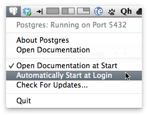
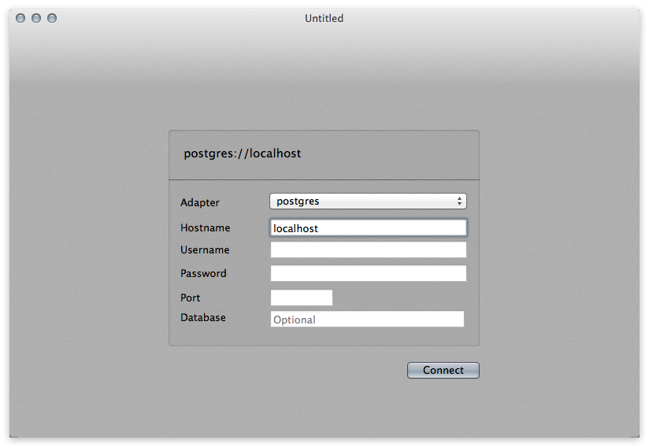
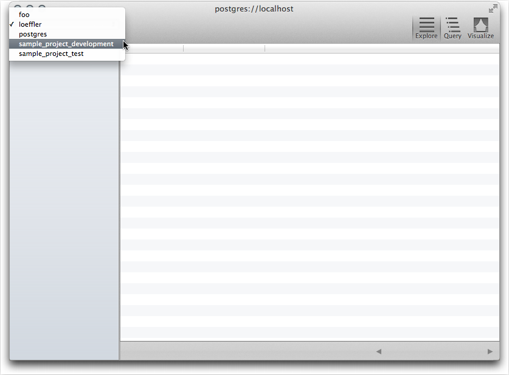
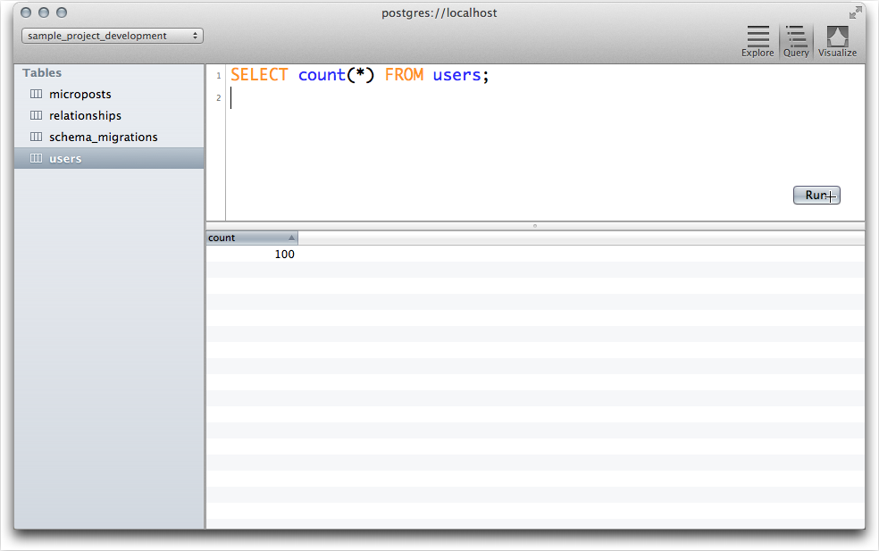

# Converting to PostgreSQL #

**FLASH:** I recently (June 27, 2012) converted to a better way of installing and using Postgres.  This one is much easier to install and is more current.  Plus, it is maintained by Mattt Thompson and source is on GitHub.  I will keep the old information at the bottom of this page.


In chapter 3 exercise 3 Michael challenges us to use [PostgreSQL] in development and testing environments since that is what [Heroku] uses in production. 

The Heroku [instructions] use **Homebrew** or **MacPorts** to install [PostgreSQL]. I have used these installers in the past for other software but not for the last few releases of OS X.  I used one described [below](#oldversion) but just recently I switched to one by Mattt Thompson called [Postgres.app].  This one is extremely easy to setup and to use.  To install just download the latest version, open the `dmg` file and drag the Postgres app to your `Applications` folder.  To start it up, just double click it.  It *is* just that easy.  A little elephant icon shows up in your status bar. 

If you click on the icon you can see Postgres is running on port 5432. You have the option of having Postgres startup when you log in (I recommend this when you are in heavy development mode.)  



If you want to use command line tools then add this to your `PATH` environment variable.

    PATH="/Applications/Postgres.app/Contents/MacOS/bin:$PATH"

You should see `psql` from the Postgres app before the one shipped with Mac OS X (10.7 is my version). 

	$ type -all psql
	psql is /Applications/Postgres.app/Contents/MacOS/bin/psql
	psql is /usr/bin/psql

`psql` shipped with OS X is in `/usr/bin` and is version 9.0.5

	$ /usr/bin/psql --version
	psql (PostgreSQL) 9.0.5
	contains support for command-line editing

The one from the Postgres app:

	$ psql --version
	psql (PostgreSQL) 9.1.3
	contains support for command-line editing
	
For the [Ruby on Rails Tutorial] this is the `database.yml` file.

	development:
	  host: localhost
	  adapter: postgresql
	  encoding: utf8
	  database: sample_project_development
	  pool: 5
	  username: 
	  password: 
	
	test:
	  host: localhost
	  adapter: postgresql
	  encoding: utf8
	  database: sample_project_test
	  pool: 5
	  username: 
	  password: 
	
	production:
	  adapter: postgresql
	  encoding: utf8
	  database: sample_project_production
	  pool: 5
	  username:
	  password:

You may have to reset the databases and repopulate if you are like me and had been using another Postgres server before switching  to [Postgres.app]. 
    
    $ bundle exec rake db:reset
    $ bundle exec rake db:test:prepare
    $ bundle exec rake db:populate
	
## Induction ##

The [Induction] application is in *alpha* but has great potential.  Installing this is optional as you can do everything through the command line interface or use [pgAdmin].  Personally I like Mattt's [Induction] application and will be using it more as I expect him to add [more features](https://github.com/Induction/Induction/blob/master/README.md) over time.

Setup is simple.  Set the **Adapter** to **postgres** and d**Hostname** to **localhost** and press **Connnect**. 



To view database tables just select **Explore** and the database from the selection box. 



This is looking at the development database users table for the sample project.  The column width can be adjusted and the order of the columns can be arranged by dragging them.


By selecting **Query** you can run queries against the database.  




## Removing Old Version ##

If you installed Postgres using my [*old*](#oldversion) instructions it can be removed if you want to use Mattt's Postgres App.

To delete the old version of Postgres just run the remove script in the `PostgreSQL` *folder*.

````bash
$ sudo /Applications/PostgreSQL/Remove\ PostgreSQL\ Installation.sh

# This script will attempt to remove all vestiges of a PostgreSQL installation
# -----------------------------------------------------------------------------
#
# User: root
# Stopping the Database
PostgreSQL Data Path: /Library/PostgreSQL/data
PostgreSQL Log Path: /Library/PostgreSQL/log/PostgreSQL.log
PostgreSQL Auto Starts: YES
PostgreSQL Manual: NO
PostgreSQL Reload: NO
Stopping PostgreSQL database services
pg_ctl: PID file "/Library/PostgreSQL/data/postmaster.pid" does not exist
Is server running?
# ...done
# Removing NetInfo entries
# ...Deleted Postgres User: 401
# ...Deleted Postgres Group: 402
# ...done
# Removing Logs & Receipts
# ...done
# Removing Files and Folders
# ...done
#
# -----------------------------------------------------------------------------
# PostgreSQL8 Has Been Removed From the System. #

````

<a name="oldversion"></a>
# Old version of this file #

In chapter 3 exercise 3 Michael challenges us to use [PostgreSQL] in development and testing environments since that is what [Heroku] uses in production. 

The Heroku [instructions] use **Homebrew** or **MacPorts** to install [PostgreSQL]. I have used these installers in the past for other software but not for the last few releases of OS X.  Instead I got an installer that works like installing any other Macintosh application from [PostgreSQL for Mac]

I used postgres for several projects in the past.  I used to download installers from the official [PostgreSQL] site but one time I got the *commercial* version by mistake and it caused me some confusion and wasted time trying to back out.  I found another site, [PostgreSQL for Mac], and provides an installer. `pg4mac_912-r2c.dmg` ([download]) which is PostgreSQL  version 9.1.2 plus some utitlities.  

This is the version after installing:

```
$ psql --version
psql (PostgreSQL) 9.1.2
contains support for command-line editing
```

I did not set a password for `postgres` since this is my personal machine and I don't have anything sensitive stored in the database.  This is my `database.yml` after I made the change to the `Gemfile` suggested by Michael.  

```ruby
development:
  host: localhost
  adapter: postgresql
  encoding: utf8
  database: sample_project_development
  pool: 5
  username: 
  password: 

test:
  host: localhost
  adapter: postgresql
  encoding: utf8
  database: sample_project_test
  pool: 5
  username: 
  password: 

production:
  adapter: postgresql
  encoding: utf8
  database: sample_project_production
  pool: 5
  username:
  password:
```

Accessing the development database from the command line:

```
$ psql -U postgres sample_project_development
psql (9.1.2)
Type "help" for help.

sample_project_development=# \d
                List of relations
 Schema |       Name        |   Type   |  Owner   
--------+-------------------+----------+----------
 public | schema_migrations | table    | loeffler
 public | users             | table    | loeffler
 public | users_id_seq      | sequence | loeffler
(3 rows)

sample_project_development=# \l
    List of databases
            Name            |  Owner   |   
----------------------------+----------+
 postgres                   | postgres | 
 sample_project_development | loeffler |  
 sample_project_test        | loeffler |  
 template0                  | postgres | 
 template1                  | postgres |
(5 rows)
```
And here is the first 10 users (at the end of chapter 9)

```sql
SELECT name,email,admin FROM users LIMIT 10;   
```

| name 	|            email 	| admin 	|
| -------------------- 	| ---------------------------- 	| :--: 	|
|  Example User 	| example@railstutorial.org 	| t 	|
| Dr. Abel Jacobs 	| example-1@railstutorial.org 	| f 	|
| Silas Kertzmann 	| example-2@railstutorial.org 	| f 	|
| Krystina Osinski 	| example-3@railstutorial.org 	| f 	|
| Melvina Lind 	| example-4@railstutorial.org 	| f 	|
| Kathryn Ward 	| example-5@railstutorial.org 	| f 	|
| Antwon Berge DVM 	| example-6@railstutorial.org 	| f 	|
| Dallin Kuhlman PhD 	| example-7@railstutorial.org 	| f 	|
| Alphonso Stoltenberg 	| example-8@railstutorial.org 	| f 	|
|  Iva Erdman II 	| example-9@railstutorial.org 	| f 	|
                                                                        

[PostgreSQL for Mac]: http://www.postgresqlformac.com/
[PostgreSQL]:http://www.postgresql.org/
[download]:http://www.postgresqlformac.com/lists/downloads/unified_installer_disk_imag/
[Heroku]:http://www.heroku.com/
[instructions]:https://devcenter.heroku.com/articles/local-postgresql
[Ruby on Rails Tutorial]:http://ruby.railstutorial.org/
[Postgres.app]:http://postgresapp.com
[Induction]:http://inductionapp.com/
[pgAdmin]:http://www.pgadmin.org/