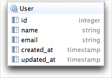
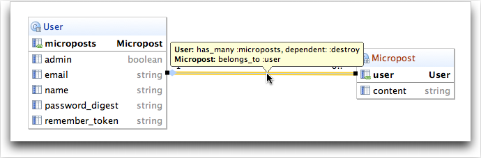

# Data Model Using RubyMine #

## Chapter 6 User Data Model ##

This is the `User` data model show in figure 6.2 in tutorial.

Structure of the Postgres table `users` you can compare with [figure 6.3](http://ruby.railstutorial.org/chapters/modeling-users#fig:sqlite_database_browser) for sqlite3 database browser.

Data Model after adding password  in section 6.3 (and )including `timestamp` columns in display).

## Chapter 10 Micropost Data Model ##

## Chapter 11 Relationship Data Model ##

