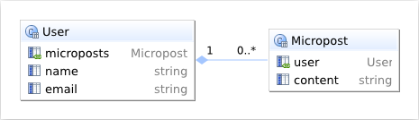

# Data Model Using RubyMine #

## Model Dependency Diagrams ##

It is easy to create a data model diagram with [RubyMine].  Here I'll do the model for the **demo_app** in the [Ruby on Rails Tutorial] in [chapter 2].  This app has just 2 models: `user` and `micropost`.  Just pick the **View** item in the RubyMine menu bar (shown below).

Then select **Show Model Dependency Diagram** **&#8963;&#8997;D** from the drop down menu.

The diagram is displayed in its own sub window.  There are a number of display options that let you see more or less information and on applications with more models there are various layout options. See the [Model Dependency Diagram video].

The diagram can be exported to a number of different formats.  

The PNG format is shown below. **Note:** the **Powered by yFiles** label on the PNG.  This can be removed from the SVG output by using an editor.  But, unfortunately SVG can not be displayed on [GitHub] 

If you export with SVG option you should be able to remove the **Powered by yFile** label.  I removed it using [Inkscape].  SVG image may not appear on this wiki so download the [SVG](images/ExportedDemoModelProjectSvg.svg) here.  Here it is converted to PNG

## Chapter 6 User Data Model ##

This is the `User` data model show in [figure 6.2](http://ruby.railstutorial.org/chapters/modeling-users#fig:user_model_initial) in tutorial. On the left from RubyMine, on the right from figure 6.2.

  

Structure of the Postgres table `users` (using [pgAdmin] tool) you can compare with [figure 6.3](http://ruby.railstutorial.org/chapters/modeling-users#fig:sqlite_database_browser) for sqlite3 database browser.

Data Model after adding password  in section 6.3 (and )including `timestamp` columns in display).

## Chapter 10 Micropost Data Model ##

Model showing just the user specified fields.  When the cursor is over a relationship brings up a popup window with more information.  Here is shows both sides, from the **User** and from **Micropost**.

This diagram shows all the columns of the tables including the **id** and **timestamp** columns. 

## Chapter 11 Relationship Data Model ##

This is the final model for the tutorial.  The two diagrams below are the same diagram but the the lower one shows the **followers** and **followed** users uses the **Relationship** class.

[Ruby on Rails Tutorial]:http://ruby.railstutorial.org/
[chapter 2]:http://ruby.railstutorial.org/chapters/a-demo-app#top
[RubyMine]: http://www.jetbrains.com/ruby/
[GitHub]:http://github.com
[pgAdmin]:http://www.pgadmin.org/