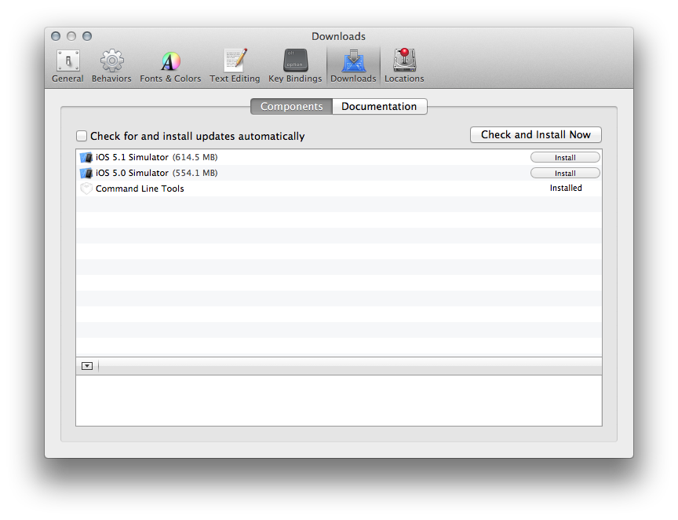

Before Mountain Lion was released we took a vacation and decided to take just one computer. So I created
a user account on my wife's Mac and started installing applications and customizing my environment so I could do
some Rails work.  Just a few days before we left I ran into problems with my old directions. There were issues with `yaml`. I was on OS 10.7 with Xcode 4.3 but I had been on Xcode 4.2 on my machine when I originally installed `[rvm]`. I did not like all the different solutions out there so I put off doing any work over vacation.

During vacation [Mountain Lion] was released.  When I returned I decided to [update my computer] with a clean install of [Mountain Lion]. A clean install can, if done correctly, can zap all the old bad stuff while still preserving your data. This took over a week of trying because of issues I had with iWork '09 but more important with deciding between `rbenv` and `[rvm]` ([RubyMine] works with both).  I would try something and rather than try to back out I would erase the disk and start over only transferring my user files and computer/network settings from my backup disk. 

Finally I found the magic sauce and, am embarrassed to say, it was too easy.

Steps I took after installing my [basic application set].

0. **Wipe out all traces of `rvm`.**  
   To do this I moved existing `~/.rvm` and `~/.rvmrc` to a new location. (I had done clean install but migrated my home directory so I had to remove some files manually.)  I commented out sections of my `~/.bashrc` and `~/.bash_profile` files that added `rvm` directories to `PATH`.

1. **Install [Xcode] 4.5.1 from App Store**  
   Originally I did 4.4.1 but recently upgraded before finishing these notes. 
   
2. **Install Command Line tools from inside Xcode.**   
     To install CL tools, launch Xcode, open preferences, click on **Downloads** then *Components*. Click install button for **Command Line Tools**. The important tool you need is `gcc`.  Why not just download the command line tool package instead of Xcode?  I'm going to be writing iOS apps that talk to my Ruby on Rails apps. All I had to do after updating to [Xcode] 4.5.1 was click on *update*. See [update window](#cli_update) below.

3. **Open  Terminal** (or [iTerm 2] application).  
   Personally I prefer [iTerm 2].
4. **Load `rvm` and `ruby` together.**  
    The RVM site [install page] suggests typing  
    `curl -L https://get.rvm.io | bash -s stable --ruby`  
    in the Terminal to install both `rvm` and `ruby`.  The output is [below](#output).  
    Originally I installed both Ruby and Rails at the same time as `rvm` using  
    `curl -L https://get.rvm.io | bash -s stable --rails`  
    but I wanted to write some command line scripts and services in Ruby but I did not want to have Rails included.  Also, I wanted to have projects where I experimented with newer versions of Rails. So I felt it better to install just [rvm] and ruby.  
    The version of [rvm] installed is:  
    `rvm 1.16.11 (stable) by Wayne E. Seguin <wayneeseguin@gmail.com>, Michal Papis <mpapis@gmail.com> [https://rvm.io/]`  
    The version of ruby installed is:  
    `ruby 1.9.3p194 (2012-04-20 revision 35410) [x86_64-darwin12.2.0]`  
    This is the ruby installed which you can verify by typing `rvm list rubies`.

5. **Setup `PATH` and define `rvm` function.**  
   To use `rvm` just type in `source ~/.rvm/scripts/rvm` into open shells, this creates the `rvm` function and adds various `~/.rvm/...` directories to `PATH`.  You can also add this line to your `~/.bashrc` file so it takes affect for all new shells.  I am going to use a slightly different approach.  I defined an alias `use_rvm='source ~/.rvm/scripts/rvm'` and then invoke it when I need to use `rvm` from the command line.      
You can also add `[[ -s "$HOME/.rvm/scripts/rvm" ]] && source "$HOME/.rvm/scripts/rvm" # Load RVM into a shell session *as a function*`  
to our `.bash_profile` or `.bashrc`  file depending how you set your environment up. 

6. **Define a `gemset` and `.rvmrc` file.**  
   If you are going to have multiple ruby/rails projects it is best to define a `gemset` and setup a `.rvmrc` file in the project's directory.  I defined `rails3tutorial2ndEd` doing  
    `rvm use 1.9.3-p194@rails3tutorial2ndEd --create`  
then `cd`'ed to my rails tutorial directory and did  
`rvm --rvmrc ruby-1.9.3-p194@rails3tutorial2ndEd`.   
This creates a [`.rvmrc`](#rvmrc).  The [rvm] setup defines  a number of functions, one is `cd`, that override or support it. The `cd` function checks to see if there is a `.rvmrc` file and sets up your ruby environment as defined by you.   [cd](#cd)
7. **Bundle Gems**  
   While in the project directory I ran `bundle install` to load the `Gemfile`.  Now when I am outside of the project I am with a default `gemset` and it changes to the correct `gemset` when I `cd` into the project directory.  See example of [gems defined inside and outside the project](#gems).

## Command Line Tools Added ##

## Ruby on Rails Version Installed ##

### [Update and/or Install Command Line Tools](id:cli_update)
This is the window in Xcode for installing or updating the command line tools.  This is from Xcode 4.5.1 and since I had already installed them under 4.4.1 I just had to update. I verified that tools updated.  `Git` and a few others had new versions.  `Gcc` stayed the same version.



Here are some of the version changes from 4.4.1 to 4.5.1

	$ git --version
	git version 1.7.9.6 (Apple Git-31.1)  # 4.4.1
	git version 1.7.10.2 (Apple Git-33)   # 4.5.1
	
	$ gcc --version                       # This remained the same.
	i686-apple-darwin11-llvm-gcc-4.2 (GCC) 4.2.1 (Based on Apple Inc. build 5658) (LLVM build 2336.11.00)
	Copyright (C) 2007 Free Software Foundation, Inc.
	This is free software; see the source for copying conditions.  There is NO
	warranty; not even for MERCHANTABILITY or FITNESS FOR A PARTICULAR PURPOSE.
	
	i686-apple-darwin11-llvm-gcc-4.2 (GCC) 4.2.1 (Based on Apple Inc. build 5658) (LLVM build 2336.11.00)
    Copyright (C) 2007 Free Software Foundation, Inc.
    This is free software; see the source for copying conditions.  There is NO
    warranty; not even for MERCHANTABILITY or FITNESS FOR A PARTICULAR PURPOSE.
    

### [RVM and Ruby Install Output](id:output)

    curl -L https://get.rvm.io | bash -s stable --ruby
      % Total    % Received % Xferd  Average Speed   Time    Time     Time  Current
                                     Dload  Upload   Total   Spent    Left  Speed
    100   185  100   185    0     0    315      0 --:--:-- --:--:-- --:--:--   455
    100 10018  100 10018    0     0   9019      0  0:00:01  0:00:01 --:--:--  143k
    Please read and follow further instructions.
    Press ENTER to continue.
    Downloading RVM from wayneeseguin branch stable
      % Total    % Received % Xferd  Average Speed   Time    Time     Time  Current
                                     Dload  Upload   Total   Spent    Left  Speed
    100   125  100   125    0     0    329      0 --:--:-- --:--:-- --:--:--   452
    100 1084k  100 1084k    0     0   625k      0  0:00:01  0:00:01 --:--:-- 1291k
    
    Installing RVM to /Users/loeffler/.rvm/
        RVM PATH line found in /Users/loeffler/.bashrc /Users/loeffler/.zshrc.
        RVM sourcing line found in /Users/loeffler/.bash_profile /Users/loeffler/.zlogin.
    
    # RVM:  Shell scripts enabling management of multiple ruby environments.
    # RTFM: https://rvm.io/
    # HELP: http://webchat.freenode.net/?channels=rvm (#rvm on irc.freenode.net)
    # Cheatsheet: http://cheat.errtheblog.com/s/rvm/
    # Screencast: http://screencasts.org/episodes/how-to-use-rvm
    
    # In case of any issues read output of 'rvm requirements' and/or 'rvm notes'
    
    Installation of RVM in /Users/loeffler/.rvm/ is almost complete:
    
      * To start using RVM you need to run `source /Users/loeffler/.rvm/scripts/rvm`
        in all your open shell windows, in rare cases you need to reopen all shell windows.
    
    # perfectionist,
    #
    #   Thank you for using RVM!
    #   I sincerely hope that RVM helps to make your life easier and more enjoyable!!!
    #
    # ~Wayne
    
    
    rvm 1.16.9 (stable) by Wayne E. Seguin <wayneeseguin@gmail.com>, Michal Papis <mpapis@gmail.com> [https://rvm.io/]
    
          1 Ruby (and needed base gems) for your selection will be installed shortly.
          2 Before it happens, please read and execute the instructions below.
          3 Please use a separate terminal to execute any additional commands.
          4 Press 'q' to continue.
    ruby-1.9.3-p194 - #configure
    ruby-1.9.3-p194 - #download
      % Total    % Received % Xferd  Average Speed   Time    Time     Time  Current
                                     Dload  Upload   Total   Spent    Left  Speed
    100 5099k  100 5099k    0     0  1218k      0  0:00:04  0:00:04 --:--:-- 1387k
    ruby-1.9.3-p194 - #extract
    ruby-1.9.3-p194 - #validate
    ruby-1.9.3-p194 - #setup
    Saving wrappers to '/Users/loeffler/.rvm/bin'.
    ruby-1.9.3-p194 - #importing default gemsets (/Users/loeffler/.rvm/gemsets/)
    Creating alias default for ruby-1.9.3-p194.
    Recording alias default for ruby-1.9.3-p194.
    Creating default links/files
    Saving wrappers to '/Users/loeffler/.rvm/bin'.
    
      * To start using RVM you need to run `source /Users/loeffler/.rvm/scripts/rvm`
        in all your open shell windows, in rare cases you need to reopen all shell windows.
        
<a name="cd"></a>
### [`cd` function](id:cd)

    cd () 
    { 
        if builtin cd "$@"; then
            [[ -n "${rvm_current_rvmrc:-}" && "$*" == "." ]] && rvm_current_rvmrc="" || true;
            __rvm_do_with_env_before;
            __rvm_project_rvmrc;
            __rvm_after_cd;
            __rvm_do_with_env_after;
            return 0;
        else
            return $?;
        fi
    }

<a name="rvmrc"></a>
### [.rvmrc file](id:rvmrc)
    
    #!/usr/bin/env bash
    
    # This is an RVM Project .rvmrc file, used to automatically load the ruby
    # development environment upon cd'ing into the directory
    
    # First we specify our desired <ruby>[@<gemset>], the @gemset name is optional,
    # Only full ruby name is supported here, for short names use:
    #     echo "rvm use 1.9.3" > .rvmrc
    environment_id="ruby-1.9.3-p194@rails3tutorial2ndEd"
    
    # Uncomment the following lines if you want to verify rvm version per project
    # rvmrc_rvm_version="1.16.11 (stable)" # 1.10.1 seams as a safe start
    # eval "$(echo ${rvm_version}.${rvmrc_rvm_version} | awk -F. '{print "[[ "$1*65536+$2*256+$3" -ge "$4*65536+$5*256+$6" ]]"}' )" || {
    #   echo "This .rvmrc file requires at least RVM ${rvmrc_rvm_version}, aborting loading."
    #   return 1
    # }
    
    # First we attempt to load the desired environment directly from the environment
    # file. This is very fast and efficient compared to running through the entire
    # CLI and selector. If you want feedback on which environment was used then
    # insert the word 'use' after --create as this triggers verbose mode.
    if [[ -d "${rvm_path:-$HOME/.rvm}/environments"
      && -s "${rvm_path:-$HOME/.rvm}/environments/$environment_id" ]]
    then
      \. "${rvm_path:-$HOME/.rvm}/environments/$environment_id"
      [[ -s "${rvm_path:-$HOME/.rvm}/hooks/after_use" ]] &&
        \. "${rvm_path:-$HOME/.rvm}/hooks/after_use" || true
    else
      # If the environment file has not yet been created, use the RVM CLI to select.
      rvm --create  "$environment_id" || {
        echo "Failed to create RVM environment '${environment_id}'."
        return 1
      }
    fi
    
    # If you use bundler, this might be useful to you:
    # if [[ -s Gemfile ]] && {
    #   ! builtin command -v bundle >/dev/null ||
    #   builtin command -v bundle | GREP_OPTIONS= \grep $rvm_path/bin/bundle >/dev/null
    # }
    # then
    #   printf "%b" "The rubygem 'bundler' is not installed. Installing it now.\n"
    #   gem install bundler
    # fi
    # if [[ -s Gemfile ]] && builtin command -v bundle >/dev/null
    # then
    #   bundle install | GREP_OPTIONS= \grep -vE '^Using|Your bundle is complete'
    # fi

<a name="gems"></a>
### [Gems and Gemset with `.rvmrc` File.](id:gems)
First is a list of gems outside the project with the normal default gemset.  Then after `cd`'ing into project directory the list includes all the gems needed for the rails project.  

**Gems** outside and inside project directory

    [loeffler@MBP17i7 RubyMine]$ gem list
    
    *** LOCAL GEMS ***
    
    bundler (1.2.1)
    rake (0.9.2.2)
    rubygems-bundler (1.1.0)
    rvm (1.11.3.5)
    
    [loeffler@MBP17i7 RubyMine]$ cd sample_project/
    [loeffler@MBP17i7 sample_project (master)]$ gem list
    
    *** LOCAL GEMS ***
    
    actionmailer (3.2.8)
    actionpack (3.2.8)
    activemodel (3.2.8)
    activerecord (3.2.8)
    activeresource (3.2.8)
    . . . # Abbreviated list.
    treetop (1.4.10)
    tzinfo (0.3.33)
    uglifier (1.2.3)
    will_paginate (3.0.3)
    xpath (0.1.4)

**Gemsets** outside and inside project directory

    [loeffler@MBP17i7 ~]$ cd RubyMine/
    [loeffler@MBP17i7 RubyMine]$ rvm list gemsets
    
    rvm gemsets
    
    => ruby-1.9.3-p194 [ x86_64 ]
       ruby-1.9.3-p194@global [ x86_64 ]
       ruby-1.9.3-p194@rails3tutorial2ndEd [ x86_64 ]
    
    [loeffler@MBP17i7 RubyMine]$ cd sample_project/  # cd into project directory
    [loeffler@MBP17i7 sample_project (master)]$ rvm list gemsets
    
    rvm gemsets
    
       ruby-1.9.3-p194 [ x86_64 ]
       ruby-1.9.3-p194@global [ x86_64 ]
    => ruby-1.9.3-p194@rails3tutorial2ndEd [ x86_64 ]

----

Another interesting feature is where 

    [loeffler@MBP17i7 sample_project (master)]$ type ruby
    ruby is /Users/loeffler/.rvm/rubies/ruby-1.9.3-p194/bin/ruby
    [loeffler@MBP17i7 sample_project (master)]$ type bundle
    bundle is /Users/loeffler/.rvm/gems/ruby-1.9.3-p194@global/bin/bundle
    [loeffler@MBP17i7 sample_project (master)]$ type rails
    rails is /Users/loeffler/.rvm/gems/ruby-1.9.3-p194@rails3tutorial2ndEd/bin/rails

Command Line tool install put in 

	$ git --version
	git version 1.7.9.6 (Apple Git-31.1)
	git version 1.7.10.2 (Apple Git-33)   
	
	$ gcc --version
	i686-apple-darwin11-llvm-gcc-4.2 (GCC) 4.2.1 (Based on Apple Inc. build 5658) (LLVM build 2336.11.00)
	Copyright (C) 2007 Free Software Foundation, Inc.
	This is free software; see the source for copying conditions.  There is NO
	warranty; not even for MERCHANTABILITY or FITNESS FOR A PARTICULAR PURPOSE.
	
	i686-apple-darwin11-llvm-gcc-4.2 (GCC) 4.2.1 (Based on Apple Inc. build 5658) (LLVM build 2336.11.00)
    Copyright (C) 2007 Free Software Foundation, Inc.
    This is free software; see the source for copying conditions.  There is NO
    warranty; not even for MERCHANTABILITY or FITNESS FOR A PARTICULAR PURPOSE.
    
    $ ruby --version
    ruby 1.9.3p194 (2012-04-20 revision 35410) [x86_64-darwin12.1.0]  
    
    ruby 1.9.3p194 (2012-04-20 revision 35410) [x86_64-darwin12.2.0]  
    
    $ rails --version
    Rails 3.2.8
    
```
loeffler=# \l
                                     List of databases
            Name            |  Owner   | Encoding | Collate | Ctype |   Access privileges   
----------------------------+----------+----------+---------+-------+-----------------------
 loeffler                   | loeffler | UTF8     | en_US   | en_US | 
 postgres                   | loeffler | UTF8     | en_US   | en_US | 
 sample_project_development | loeffler | UTF8     | en_US   | en_US | 
 sample_project_test        | loeffler | UTF8     | en_US   | en_US | 
```

```
[loeffler@MBP17i7 sample_project (master)]$ 
```

```
[loeffler@MBP17i7 sample_project (master)]$ type ruby
ruby is /Users/loeffler/.rvm/rubies/ruby-1.9.3-p194/bin/ruby
[loeffler@MBP17i7 sample_project (master)]$ type bundle
bundle is /Users/loeffler/.rvm/gems/ruby-1.9.3-p194@global/bin/bundle
[loeffler@MBP17i7 sample_project (master)]$ type rails
rails is /Users/loeffler/.rvm/gems/ruby-1.9.3-p194@rails3tutorial2ndEd/bin/rails
```

[Mountain Lion]:http://www.apple.com/osx/
[update my computer]:http://ddloeffler.blogspot.com/2012/09/migration-to-mountain-lion.html
[RubyMine]:http://www.jetbrains.com/ruby/
[rvm]:https://rvm.io
[install]:https://rvm.io/rvm/install/
[basic application set]:http://ddloeffler.blogspot.com/2012/09/migration-to-mountain-lion.html
[Xcode]:https://developer.apple.com/technologies/tools/
[this]:https://github.com/perfectionist/sample_project/wiki/rvm_install_output.txt
[install page]:https://rvm.io/rvm/install/
[.rvmrc]:.rvmrc.text
[iTerm 2]:http://www.iterm2.com/#/section/home
