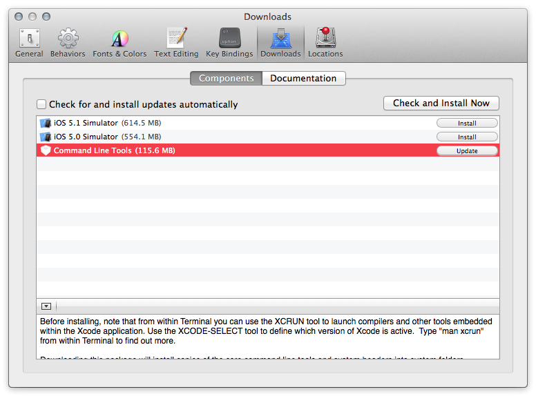

Before Mountain Lion was released we took a vacation and decided to take just one computer. So I created
a user account on my wife's Mac and started installing applications and customizing my environment so I could do
some Rails work.  Just a few days before we left I ran into problems with my old directions. There were issues with `yaml`. I was on OS 10.7 with Xcode 4.3 but I had been on Xcode 4.2 on my machine when I originally installed `[rvm]`. I did not like all the different solutions out there so I put off doing any work over vacation.

During vacation [Mountain Lion] was released.  When I returned I decided to [update my computer] with a clean install of [Mountain Lion]. A clean install can, if done correctly, can zap all the old bad stuff while still preserving your data. This took over a week of trying because of issues I had with iWork '09 but more important with deciding between `rbenv` and `[rvm]` ([RubyMine] works with both).  I would try something and rather than try to back out I would erase the disk and start over only transferring my user files and computer/network settings from my backup disk.

Finally I found the magic sauce and, am embarrassed to say, it was too easy.

Steps I took after installing my [basic application set] to work with the **first_app** rails project.

0. **Wipe out all traces of `rvm`.**  
   To do this I moved existing `~/.rvm` and `~/.rvmrc` to a new location. (I had done clean install but migrated my home directory so I had to remove some files manually.)  I commented out sections of my `~/.bashrc` and `~/.bash_profile` files that added `rvm` directories to `PATH`.

1. **Install [Xcode] 4.5.1 from App Store**  
   Originally I installed 4.4.1 but recently upgraded before finishing these notes. 
   
2. **Install Command Line tools from inside Xcode.**   
     To install CL tools, launch Xcode, open preferences, click on **Downloads** then **Components**. Click install button for **Command Line Tools**. The important tool you need is `gcc`.  Why not just download the command line tool package instead of Xcode?  I'm going to be writing iOS apps that talk to my Ruby on Rails apps. All I had to do after updating to [Xcode] 4.5.1 was click on *update*. See [update window](#cli_update) below. 

3. **Open  Terminal** (or [iTerm 2] application).  
   Personally I prefer [iTerm 2] but the Terminal app works just as well.
   
4. **Load `rvm` and `ruby` together.**  
    The RVM site [install page] suggests typing 
     
    `curl -L https://get.rvm.io | bash -s stable --ruby`  
    
    in the Terminal to install both `rvm` and `ruby`.  The output is [below](#output).   
    Originally I installed both Ruby and Rails at the same time as `rvm` using  
    
    `curl -L https://get.rvm.io | bash -s stable --rails`  
    
    but I wanted to write some command line scripts and services in Ruby but I did not want to have Rails included.  Also, I wanted to have projects where I experimented with newer versions of Rails. So I felt it better to install just [rvm] and ruby.  
    
    The version of [rvm] installed is: 
     
    `rvm 1.16.11 (stable) by Wayne E. Seguin <wayneeseguin@gmail.com>, Michal Papis <mpapis@gmail.com> [https://rvm.io/]`  
    
    The version of ruby installed is:  
    
    `ruby 1.9.3p194 (2012-04-20 revision 35410) [x86_64-darwin12.2.0]`  
    
    This is the ruby installed which you can verify by typing `rvm list rubies`.

5. **Setup `PATH` and define `rvm` function.**  
   To use `rvm` just type  
     
    `source ~/.rvm/scripts/rvm`  
    
    into open shells, this creates the `rvm` function and adds various `~/.rvm/...` directories to `PATH`.  
    You can also add this line to your `~/.bashrc` file so it takes affect for all new shells.  
    I was going to use a slightly different approach so I defined an alias 
   
    `use_rvm='source ~/.rvm/scripts/rvm'` 
    
    and then invoked it when I needed to use `rvm` from the command line.      
   
    But I decided to install the following line in my `.bash_profile` 
   
    `[[ -s "$HOME/.rvm/scripts/rvm" ]] && source "$HOME/.rvm/scripts/rvm" `
     
    You can add the line to your `.bash_profile` or `.bashrc`  file depending how you set your environment up.
    This defines the `rvm` function and modifies your `PATH` only if the the `~/.rvm/scripts/rvm` 
    file exists. This is preferable to just adding the `source` statement.

    *Side Note:*  RVM defines some really need shell scripts and functions.  Reading these scripts and learn shell programming.  
     Examples are the [`rvm` function](#rvmfunction) and [`cd` function](#cdfunction).  

6. **Define a `gemset` for your project.**  
   This is my *recipe* for using `rvm` to control versions of Ruby, Rails and gem files based on 
   blog: [RVM Workflow for a New Rails App][rakeroutes].
   Define a gemset for the project first, in this case `first_project`
   
    `$ rvm use 1.9.3-p194@first_project --create`
   
    This says **create** the gemset `1.9.3-p194@first_project` and then **use** it.  That makes it the default 
    gem only for the open Terminal (or iTerm) shell you are working in.  [Listing the **gemsets**](#gemsets) shows `rvm` adds `ruby-` to 
    gemset name.

7. **Create the project directory.**  
    Do this my creating the rails project.  In this case the project is `first_project`.  First `cd` 
    to the directory holding your rails project(s). In my case this directory is `~/RubyMine` then 
    create the project with:  
   
    `$ rails new first_project`
   
    This creates the `first_project` directory, a `Gemfile` and the whole rails eco system.
   
8. **Add the `.rvmrc` file.**
   
    Now we want `rvm` to automatically switch to the correct **gemset** when we `cd` into the project's
    directory structure. 
   
        cd first_project
        rvm --rvmrc ruby-1.9.3-p194@first_project
       
    The create the `.rvmc` file shown [below](#rvmrc). Now, whenever we `cd` into the `first_project` directory
    structure we'll automagically be in the `ruby-1.9.3-p194@first_project` gemset because of `cd` is a [function](#cdfunction). 
   
This wraps up the basic install of [RVM] and how to setup to use it with projects. 

The first project does not need any editing and can be run from the command line using `rails s`.  However, I am only able to browse [http://127.0.0.1:3000](http://127.0.0.1:3000) and not [http://localhost:3000](http://localhost:3000) or [http://0.0.0.0:3000](http://0.0.0.0:3000). [^localhostissue]

[^localhostissue]: I am looking into this issue.  It  just started happening since I upgraded to Mountain Lion.

* * *  

## Supporting Documentation ##


<a name="cli_update"></a>
### [Update and/or Install Command Line Tools](id:cli_update)
This is the window in Xcode for installing or updating the command line tools.  This is from Xcode 4.5.1 and since I had already installed them under 4.4.1 I just had to update. I verified that tools updated.  `git` and a few others had new versions.  `gcc` stayed the same version.



Here are a couple of command line tool version changes from Xcode 4.4.1 to 4.5.1.


	$ git --version
	git version 1.7.9.6 (Apple Git-31.1)  # 4.4.1
	git version 1.7.10.2 (Apple Git-33)   # 4.5.1
	
	$ gcc --version                       # This remained the same.
	i686-apple-darwin11-llvm-gcc-4.2 (GCC) 4.2.1 (Based on Apple Inc. build 5658) (LLVM build 2336.11.00)
	Copyright (C) 2007 Free Software Foundation, Inc.
	This is free software; see the source for copying conditions.  There is NO
	warranty; not even for MERCHANTABILITY or FITNESS FOR A PARTICULAR PURPOSE.
	    
<a name="output"></a>
### [RVM and Ruby Install Output](id:output)

    curl -L https://get.rvm.io | bash -s stable --ruby
      % Total    % Received % Xferd  Average Speed   Time    Time     Time  Current
                                     Dload  Upload   Total   Spent    Left  Speed
    100   185  100   185    0     0    315      0 --:--:-- --:--:-- --:--:--   455
    100 10018  100 10018    0     0   9019      0  0:00:01  0:00:01 --:--:--  143k
    Please read and follow further instructions.
    Press ENTER to continue.
    Downloading RVM from wayneeseguin branch stable
      % Total    % Received % Xferd  Average Speed   Time    Time     Time  Current
                                     Dload  Upload   Total   Spent    Left  Speed
    100   125  100   125    0     0    329      0 --:--:-- --:--:-- --:--:--   452
    100 1084k  100 1084k    0     0   625k      0  0:00:01  0:00:01 --:--:-- 1291k
    
    Installing RVM to /Users/loeffler/.rvm/
        RVM PATH line found in /Users/loeffler/.bashrc /Users/loeffler/.zshrc.
        RVM sourcing line found in /Users/loeffler/.bash_profile /Users/loeffler/.zlogin.
    
    # RVM:  Shell scripts enabling management of multiple ruby environments.
    # RTFM: https://rvm.io/
    # HELP: http://webchat.freenode.net/?channels=rvm (#rvm on irc.freenode.net)
    # Cheatsheet: http://cheat.errtheblog.com/s/rvm/
    # Screencast: http://screencasts.org/episodes/how-to-use-rvm
    
    # In case of any issues read output of 'rvm requirements' and/or 'rvm notes'
    
    Installation of RVM in /Users/loeffler/.rvm/ is almost complete:
    
      * To start using RVM you need to run `source /Users/loeffler/.rvm/scripts/rvm`
        in all your open shell windows, in rare cases you need to reopen all shell windows.
    
    # perfectionist,
    #
    #   Thank you for using RVM!
    #   I sincerely hope that RVM helps to make your life easier and more enjoyable!!!
    #
    # ~Wayne
    
    
    rvm 1.16.9 (stable) by Wayne E. Seguin <wayneeseguin@gmail.com>, Michal Papis <mpapis@gmail.com> [https://rvm.io/]
    
          1 Ruby (and needed base gems) for your selection will be installed shortly.
          2 Before it happens, please read and execute the instructions below.
          3 Please use a separate terminal to execute any additional commands.
          4 Press 'q' to continue.
    ruby-1.9.3-p194 - #configure
    ruby-1.9.3-p194 - #download
      % Total    % Received % Xferd  Average Speed   Time    Time     Time  Current
                                     Dload  Upload   Total   Spent    Left  Speed
    100 5099k  100 5099k    0     0  1218k      0  0:00:04  0:00:04 --:--:-- 1387k
    ruby-1.9.3-p194 - #extract
    ruby-1.9.3-p194 - #validate
    ruby-1.9.3-p194 - #setup
    Saving wrappers to '/Users/loeffler/.rvm/bin'.
    ruby-1.9.3-p194 - #importing default gemsets (/Users/loeffler/.rvm/gemsets/)
    Creating alias default for ruby-1.9.3-p194.
    Recording alias default for ruby-1.9.3-p194.
    Creating default links/files
    Saving wrappers to '/Users/loeffler/.rvm/bin'.
    
      * To start using RVM you need to run `source /Users/loeffler/.rvm/scripts/rvm`
        in all your open shell windows, in rare cases you need to reopen all shell windows.
        
<a name="cdfunction"></a>
### [`cd` function](id:cdfunction)###

    cd () 
    { 
        if builtin cd "$@"; then
            [[ -n "${rvm_current_rvmrc:-}" && "$*" == "." ]] && rvm_current_rvmrc="" || true;
            __rvm_do_with_env_before;
            __rvm_project_rvmrc;
            __rvm_after_cd;
            __rvm_do_with_env_after;
            return 0;
        else
            return $?;
        fi
    }


<a name="rvmfunciton"></a>
###[`rvm` Function](Id:rvmfunction) ###


	rvm () 
	{ 
	    typeset result current_result;
	    export -a rvm_ruby_args > /dev/null 2> /dev/null;
	    rvm_ruby_args=();
	    if (( ${rvm_ignore_rvmrc:=0} == 0 )); then
	        [[ -n "${rvm_stored_umask:-}" ]] || export rvm_stored_umask=$(umask);
	        rvm_rvmrc_files=("/etc/rvmrc" "$HOME/.rvmrc");
	        if [[ -n "${rvm_prefix:-}" ]] && [[ ! "$HOME/.rvmrc" -ef "${rvm_prefix}/.rvmrc" ]]; then
	            rvm_rvmrc_files+=("${rvm_prefix}/.rvmrc");
	        fi;
	        for rvmrc in "${rvm_rvmrc_files[@]}";
	        do
	            if [[ -f "$rvmrc" ]]; then
	                if GREP_OPTIONS="" \grep '^\s*rvm .*$' "$rvmrc" > /dev/null 2>&1; then
	                    printf "%b" "
	Error:
	        $rvmrc is for rvm settings only.
	        rvm CLI may NOT be called from within $rvmrc.
	        Skipping the loading of $rvmrc";
	                    return 1;
	                else
	                    source "$rvmrc";
	                fi;
	            fi;
	        done;
	        unset rvm_rvmrc_files;
	    fi;
	    disk_version="$(cat "$rvm_path/VERSION") ($(cat "$rvm_path/RELEASE" 2>/dev/null))";
	    if [[ -s "$rvm_path/VERSION" && "${rvm_version:-}" != "${disk_version:-}" && "reload" != "${1:-}" ]]; then
	        if (( ${rvm_auto_reload_flag:-0} )); then
	            __rvm_project_rvmrc_lock=0;
	            rvm_reload_flag=1;
	            source "${rvm_scripts_path:-${rvm_path}/scripts}/rvm";
	        else
	            printf "%b" "
	A RVM version ${disk_version} is installed yet ${rvm_version} is loaded.
	Please do one of the following:
	  * 'rvm reload'
	  * open a new shell
	  * 'echo rvm_auto_reload_flag=1 >> ~/.rvmrc' # for auto reload with msg.
	  * 'echo rvm_auto_reload_flag=2 >> ~/.rvmrc' # for silent auto reload.
	
	";
	            return 1;
	        fi;
	    fi;
	    __rvm_initialize;
	    __rvm_setup;
	    next_token="$1";
	    (( $# == 0 )) || shift;
	    __rvm_parse_args "$@";
	    result=$?;
	    : rvm_ruby_args:${#rvm_ruby_args[@]}:${rvm_ruby_args[*]}:;
	    (( result )) || case "${rvm_action:=usage}" in 
	        use)
	            if rvm_is_a_shell_function; then
	                __rvm_use;
	            fi
	        ;;
	        switch)
	            if rvm_is_a_shell_function; then
	                __rvm_switch "${rvm_ruby_args[@]}";
	            fi
	        ;;
	        srcdir)
	            __rvm_source_dir
	        ;;
	        inspect | usage | strings | version)
	            __rvm_${rvm_action}
	        ;;
	        ls | list)
	            "$rvm_scripts_path/list" "${rvm_ruby_args[@]}"
	        ;;
	        debug)
	            rvm_is_not_a_shell_function="${rvm_is_not_a_shell_function}" "$rvm_scripts_path/info" '' debug
	        ;;
	        info)
	            rvm_is_not_a_shell_function="${rvm_is_not_a_shell_function}" "$rvm_scripts_path/${rvm_action}" "${rvm_ruby_args[@]}"
	        ;;
	        benchmark | reset)
	            source "$rvm_scripts_path/functions/${rvm_action}";
	            __rvm_${rvm_action}
	        ;;
	        update)
	            printf "%b" "ERROR: rvm update has been removed. See 'rvm get' and rvm 'rubygems' CLI API instead\n"
	        ;;
	        reboot)
	            source "$rvm_scripts_path/functions/cleanup";
	            __rvm_reboot
	        ;;
	        implode | seppuku)
	            source "$rvm_scripts_path/functions/implode";
	            __rvm_implode
	        ;;
	        get)
	            next_token="${1:-}";
	            (( $# == 0 )) || shift;
	            [[ "$next_token" == "${rvm_action}" ]] && shift;
	            tmpdir="${TMPDIR:-/tmp}";
	            \cp -f "$rvm_scripts_path/get" "$tmpdir/$$";
	            if bash "$tmpdir/$$" "${rvm_ruby_args[@]}"; then
	                rvm_reload_flag=1;
	            else
	                rvm_error "Could not update RVM, get some help at #rvm IRC channel at freenode servers.";
	            fi;
	            \rm -f $tmpdir/$$
	        ;;
	        help | rtfm | env | current | list | monitor | notes | package | extract | pkg | requirements)
	            next_token="${1:-}";
	            (( $# == 0 )) || shift;
	            if (( $# )) && [[ "$next_token" == "${rvm_action}" ]]; then
	                shift;
	            fi;
	            "$rvm_scripts_path/${rvm_action}" "${rvm_ruby_args[@]}"
	        ;;
	        cleanup | tools | snapshot | disk-usage | repair | alias | docs | rubygems | migrate | upgrade | cron)
	            __rvm_run_script "$rvm_action" "${rvm_ruby_args[@]}"
	        ;;
	        wrapper)
	            "$rvm_scripts_path/wrapper" "$rvm_ruby_string" "$rvm_wrapper_name" "${rvm_ruby_args[@]}";
	            result=$?;
	            unset rvm_wrapper_name
	        ;;
	        do)
	            old_rvm_ruby_string=${rvm_ruby_string:-};
	            unset rvm_ruby_string;
	            export rvm_ruby_strings;
	            ( if [[ -n "${rvm_in_flag}" && -d "${rvm_in_flag}" ]]; then
	                chpwd_functions="" builtin cd "${rvm_in_flag}";
	            fi;
	            "$rvm_scripts_path/set" "$rvm_action" "${rvm_ruby_args[@]}" );
	            result=$?;
	            [[ -n "$old_rvm_ruby_string" ]] && rvm_ruby_string=$old_rvm_ruby_string;
	            unset old_rvm_ruby_string
	        ;;
	        rvmrc)
	            __rvm_rvmrc_tools "${rvm_ruby_args[@]}"
	        ;;
	        gemset)
	            if [[ ${rvm_use_flag:-0} -eq 1 ]]; then
	                __rvm_gemset_use;
	            else
	                export rvm_ruby_strings;
	                "$rvm_scripts_path/gemsets" "${rvm_ruby_args[@]}";
	                result=$?;
	                rvm_ruby_strings="";
	                if [[ ${rvm_delete_flag:-0} -eq 1 ]]; then
	                    if [[ "${GEM_HOME:-""}" == "${GEM_HOME%%${rvm_gemset_separator:-@}*}${rvm_gemset_separator:-@}${rvm_gemset_name}" ]]; then
	                        rvm_delete_flag=0;
	                        rvm_ruby_string="@default";
	                        __rvm_use;
	                    fi;
	                    unset gem_prefix;
	                else
	                    if [[ "${rvm_ruby_args[*]}" =~ ^rename ]]; then
	                        typeset _command _from _to;
	                        read _command _from _to <<< "${rvm_ruby_args[*]}";
	                        if [[ "${GEM_HOME:-""}" == "${GEM_HOME%%${rvm_gemset_separator:-@}*}${rvm_gemset_separator:-@}${_from}" ]]; then
	                            rvm_ruby_string="@${_to}";
	                            __rvm_use;
	                        fi;
	                    fi;
	                fi;
	            fi
	        ;;
	        reload)
	            rvm_reload_flag=1
	        ;;
	        tests | specs)
	            rvm_action="rake";
	            __rvm_do
	        ;;
	        remove)
	            export rvm_path;
	            if [[ -n "${rvm_ruby_strings}" ]]; then
	                __rvm_manage_wrapper "$rvm_action" "${rvm_ruby_strings//*-- }";
	            else
	                __rvm_manage_wrapper "$rvm_action";
	            fi;
	            rvm_ruby_string=default;
	            __rvm_use
	        ;;
	        fetch | uninstall | reinstall)
	            export rvm_path;
	            if [[ -n "${rvm_ruby_strings}" ]]; then
	                __rvm_manage_wrapper "$rvm_action" "${rvm_ruby_strings//*-- }";
	            else
	                __rvm_manage_wrapper "$rvm_action";
	            fi
	        ;;
	        try_install | install)
	            export rvm_path;
	            if [[ -n "${rvm_ruby_strings}" ]]; then
	                typeset save_ruby;
	                selected_ruby="$( __rvm_select && echo $rvm_env_string )";
	                if [[ -z "${selected_ruby}" ]]; then
	                    rvm_error "Could not detect ruby version/name for installation, please be more specific.";
	                    false;
	                else
	                    if (( ${rvm_force_flag:-0} == 0 )) && "$rvm_scripts_path"/list strings | GREP_OPTIONS="" \grep "^${selected_ruby%${rvm_gemset_separator:-'@'}*}$" > /dev/null; then
	                        rvm_log "Already installed ${selected_ruby%${rvm_gemset_separator:-'@'}*}.
	To reinstall use:
	
	    rvm reinstall ${rvm_ruby_strings}
	";
	                    else
	                        if [[ $(ls -1 $rvm_rubies_path/*/bin/ruby 2>/dev/null | wc -l) -eq 0 ]] && rvm_is_a_shell_function no_warning; then
	                            { 
	                                echo "Ruby (and needed base gems) for your selection will be installed shortly.";
	                                echo "Before it happens, please read and execute the instructions below.";
	                                echo "Please use a separate terminal to execute any additional commands.";
	                                "$rvm_scripts_path"/requirements;
	                                echo "Press 'q' to continue."
	                            } | less;
	                        fi;
	                        __rvm_manage_wrapper install "${rvm_ruby_strings}";
	                    fi;
	                fi;
	            else
	                rvm_error "Can not use or install 'all' rubies.";
	                false;
	            fi
	        ;;
	        mount | automount | prepare)
	            "${rvm_scripts_path}/external" "$rvm_action" "$rvm_ruby_string" "${rvm_ruby_args[@]}"
	        ;;
	        export)
	            __rvm_export "$rvm_export_args"
	        ;;
	        unexport)
	            __rvm_unset_exports
	        ;;
	        error)
	            false
	        ;;
	        answer)
	            source "$rvm_scripts_path/functions/fun";
	            __rvm_Answer_to_the_Ultimate_Question_of_Life_the_Universe_and_Everything;
	            result=42
	        ;;
	        question)
	            source "$rvm_scripts_path/functions/fun";
	            __rvm_ultimate_question;
	            result=42
	        ;;
	        *)
	            rvm_error "unknown action '$rvm_action'";
	            false
	        ;;
	    esac;
	    current_result=$?;
	    (( result )) || result=${current_result};
	    (( result )) || case "$rvm_action" in 
	        reinstall | try_install | install)
	            if [[ $(ls -1 $rvm_rubies_path/*/bin/ruby 2>/dev/null | wc -l) -eq 1 ]] && [[ ! -f "${rvm_environments_path}/default" ]] && rvm_is_a_shell_function no_warning; then
	                rvm_log "";
	                rvm_verbose_flag=0 rvm_default_flag=1 __rvm_use;
	            fi
	        ;;
	    esac;
	    current_result=$?;
	    (( result )) || result=${current_result};
	    if [[ ${rvm_reload_flag:-0} -eq 1 ]]; then
	        __rvm_project_rvmrc_lock=0;
	        source "$rvm_scripts_path/rvm";
	    fi;
	    typeset __local_rvm_trace_flag;
	    __local_rvm_trace_flag=${rvm_trace_flag:-0};
	    __rvm_teardown;
	    if (( __local_rvm_trace_flag > 0 )); then
	        set +o verbose;
	        set +o xtrace;
	        [[ -n "${ZSH_VERSION:-""}" ]] || set +o errtrace;
	    fi;
	    return ${result:-0}
	}
	
	
<a name="gemsets"></a>
###[Listing Gemsets](id:gemsets) ###

`rvm` will add `ruby-` to gemset name if necessary when the gemset is created.

```
loeffler@MBP17i7 first_project]$ rvm list gemsets

rvm gemsets

   ruby-1.9.3-p194 [ x86_64 ]
=> ruby-1.9.3-p194@first_project [ x86_64 ]
   ruby-1.9.3-p194@global [ x86_64 ]
   ruby-1.9.3-p194@rails3tutorial2ndEd [ x86_64 ]
```


### `.rvmrc` File [rvmrc] ###

```bash 
#!/usr/bin/env bash

# This is an RVM Project .rvmrc file, used to automatically load the ruby
# development environment upon cd'ing into the directory

# First we specify our desired <ruby>[@<gemset>], the @gemset name is optional,
# Only full ruby name is supported here, for short names use:
#     echo "rvm use 1.9.3" > .rvmrc
environment_id="ruby-1.9.3-p194@first_project"

# Uncomment the following lines if you want to verify rvm version per project
# rvmrc_rvm_version="1.16.11 (stable)" # 1.10.1 seams as a safe start
# eval "$(echo ${rvm_version}.${rvmrc_rvm_version} | awk -F. '{print "[[ "$1*65536+$2*256+$3" -ge "$4*65536+$5*256+$6" ]]"}' )" || {
#   echo "This .rvmrc file requires at least RVM ${rvmrc_rvm_version}, aborting loading."
#   return 1
# }

# First we attempt to load the desired environment directly from the environment
# file. This is very fast and efficient compared to running through the entire
# CLI and selector. If you want feedback on which environment was used then
# insert the word 'use' after --create as this triggers verbose mode.
if [[ -d "${rvm_path:-$HOME/.rvm}/environments"
  && -s "${rvm_path:-$HOME/.rvm}/environments/$environment_id" ]]
then
  \. "${rvm_path:-$HOME/.rvm}/environments/$environment_id"
  [[ -s "${rvm_path:-$HOME/.rvm}/hooks/after_use" ]] &&
    \. "${rvm_path:-$HOME/.rvm}/hooks/after_use" || true
else
  # If the environment file has not yet been created, use the RVM CLI to select.
  rvm --create  "$environment_id" || {
    echo "Failed to create RVM environment '${environment_id}'."
    return 1
  }
fi

# If you use bundler, this might be useful to you:
# if [[ -s Gemfile ]] && {
#   ! builtin command -v bundle >/dev/null ||
#   builtin command -v bundle | GREP_OPTIONS= \grep $rvm_path/bin/bundle >/dev/null
# }
# then
#   printf "%b" "The rubygem 'bundler' is not installed. Installing it now.\n"
#   gem install bundler
# fi
# if [[ -s Gemfile ]] && builtin command -v bundle >/dev/null
# then
#   bundle install | GREP_OPTIONS= \grep -vE '^Using|Your bundle is complete'
# Fi #

```

<a name="gems"></a>
### [Gems and Gemset with `.rvmrc` File.](id:gems)
First is a list of gems outside the project with the normal default gemset.  Then after `cd`'ing into project directory the list includes all the gems needed for the rails project.  

**Gems** outside and inside project directory

    [loeffler@MBP17i7 RubyMine]$ gem list
    
    *** LOCAL GEMS ***
    
    bundler (1.2.1)
    rake (0.9.2.2)
    rubygems-bundler (1.1.0)
    rvm (1.11.3.5)
    
    [loeffler@MBP17i7 RubyMine]$ cd sample_project/
    [loeffler@MBP17i7 sample_project (master)]$ gem list
    
    *** LOCAL GEMS ***
    
    actionmailer (3.2.8)
    actionpack (3.2.8)
    activemodel (3.2.8)
    activerecord (3.2.8)
    activeresource (3.2.8)
    . . . # Abbreviated list.
    treetop (1.4.10)
    tzinfo (0.3.33)
    uglifier (1.2.3)
    will_paginate (3.0.3)
    xpath (0.1.4)

**Gemsets** outside and inside project directory

    [loeffler@MBP17i7 ~]$ cd RubyMine/
    [loeffler@MBP17i7 RubyMine]$ rvm list gemsets
    
    rvm gemsets
    
    => ruby-1.9.3-p194 [ x86_64 ]
       ruby-1.9.3-p194@global [ x86_64 ]
       ruby-1.9.3-p194@rails3tutorial2ndEd [ x86_64 ]
    
    [loeffler@MBP17i7 RubyMine]$ cd sample_project/  # cd into project directory
    [loeffler@MBP17i7 sample_project (master)]$ rvm list gemsets
    
    rvm gemsets
    
       ruby-1.9.3-p194 [ x86_64 ]
       ruby-1.9.3-p194@global [ x86_64 ]
    => ruby-1.9.3-p194@rails3tutorial2ndEd [ x86_64 ]

----

Another interesting feature is where 

    [loeffler@MBP17i7 sample_project (master)]$ type ruby
    ruby is /Users/loeffler/.rvm/rubies/ruby-1.9.3-p194/bin/ruby
    [loeffler@MBP17i7 sample_project (master)]$ type bundle
    bundle is /Users/loeffler/.rvm/gems/ruby-1.9.3-p194@global/bin/bundle
    [loeffler@MBP17i7 sample_project (master)]$ type rails
    rails is /Users/loeffler/.rvm/gems/ruby-1.9.3-p194@rails3tutorial2ndEd/bin/rails

Command Line tool install put in 

	$ git --version
	git version 1.7.9.6 (Apple Git-31.1)
	git version 1.7.10.2 (Apple Git-33)   
	
	$ gcc --version
	i686-apple-darwin11-llvm-gcc-4.2 (GCC) 4.2.1 (Based on Apple Inc. build 5658) (LLVM build 2336.11.00)
	Copyright (C) 2007 Free Software Foundation, Inc.
	This is free software; see the source for copying conditions.  There is NO
	warranty; not even for MERCHANTABILITY or FITNESS FOR A PARTICULAR PURPOSE.
	
	i686-apple-darwin11-llvm-gcc-4.2 (GCC) 4.2.1 (Based on Apple Inc. build 5658) (LLVM build 2336.11.00)
    Copyright (C) 2007 Free Software Foundation, Inc.
    This is free software; see the source for copying conditions.  There is NO
    warranty; not even for MERCHANTABILITY or FITNESS FOR A PARTICULAR PURPOSE.
    
    $ ruby --version
    ruby 1.9.3p194 (2012-04-20 revision 35410) [x86_64-darwin12.1.0]  
    
    ruby 1.9.3p194 (2012-04-20 revision 35410) [x86_64-darwin12.2.0]  
    
    $ rails --version
    Rails 3.2.8
    
```
loeffler=# \l
                                     List of databases
            Name            |  Owner   | Encoding | Collate | Ctype |   Access privileges   
----------------------------+----------+----------+---------+-------+-----------------------
 loeffler                   | loeffler | UTF8     | en_US   | en_US | 
 postgres                   | loeffler | UTF8     | en_US   | en_US | 
 sample_project_development | loeffler | UTF8     | en_US   | en_US | 
 sample_project_test        | loeffler | UTF8     | en_US   | en_US | 
```

```
[loeffler@MBP17i7 sample_project (master)]$ 
```

```
[loeffler@MBP17i7 sample_project (master)]$ type ruby
ruby is /Users/loeffler/.rvm/rubies/ruby-1.9.3-p194/bin/ruby
[loeffler@MBP17i7 sample_project (master)]$ type bundle
bundle is /Users/loeffler/.rvm/gems/ruby-1.9.3-p194@global/bin/bundle
[loeffler@MBP17i7 sample_project (master)]$ type rails
rails is /Users/loeffler/.rvm/gems/ruby-1.9.3-p194@rails3tutorial2ndEd/bin/rails
```

```
[loeffler@MBP17i7 first_project]$ gem install rails -v 3.2.8
Fetching: i18n-0.6.1.gem (100%)
Fetching: multi_json-1.3.6.gem (100%)
Fetching: activesupport-3.2.8.gem (100%)
Fetching: builder-3.0.4.gem (100%)
Fetching: activemodel-3.2.8.gem (100%)
Fetching: rack-1.4.1.gem (100%)
Fetching: rack-cache-1.2.gem (100%)
Fetching: rack-test-0.6.2.gem (100%)
Fetching: journey-1.0.4.gem (100%)
Fetching: hike-1.2.1.gem (100%)
Fetching: tilt-1.3.3.gem (100%)
Fetching: sprockets-2.1.3.gem (100%)
Fetching: erubis-2.7.0.gem (100%)
Fetching: actionpack-3.2.8.gem (100%)
Fetching: arel-3.0.2.gem (100%)
Fetching: tzinfo-0.3.33.gem (100%)
Fetching: activerecord-3.2.8.gem (100%)
Fetching: activeresource-3.2.8.gem (100%)
Fetching: mime-types-1.19.gem (100%)
Fetching: polyglot-0.3.3.gem (100%)
Fetching: treetop-1.4.11.gem (100%)
Fetching: mail-2.4.4.gem (100%)
Fetching: actionmailer-3.2.8.gem (100%)
Fetching: rack-ssl-1.3.2.gem (100%)
Fetching: thor-0.16.0.gem (100%)
Fetching: json-1.7.5.gem (100%)
Building native extensions.  This could take a while...
Fetching: rdoc-3.12.gem (100%)
Depending on your version of ruby, you may need to install ruby rdoc/ri data:

<= 1.8.6 : unsupported
 = 1.8.7 : gem install rdoc-data; rdoc-data --install
 = 1.9.1 : gem install rdoc-data; rdoc-data --install
>= 1.9.2 : nothing to do! Yay!
Fetching: railties-3.2.8.gem (100%)
Fetching: rails-3.2.8.gem (100%)
Successfully installed i18n-0.6.1
Successfully installed multi_json-1.3.6
Successfully installed activesupport-3.2.8
Successfully installed builder-3.0.4
Successfully installed activemodel-3.2.8
Successfully installed rack-1.4.1
Successfully installed rack-cache-1.2
Successfully installed rack-test-0.6.2
Successfully installed journey-1.0.4
Successfully installed hike-1.2.1
Successfully installed tilt-1.3.3
Successfully installed sprockets-2.1.3
Successfully installed erubis-2.7.0
Successfully installed actionpack-3.2.8
Successfully installed arel-3.0.2
Successfully installed tzinfo-0.3.33
Successfully installed activerecord-3.2.8
Successfully installed activeresource-3.2.8
Successfully installed mime-types-1.19
Successfully installed polyglot-0.3.3
Successfully installed treetop-1.4.11
Successfully installed mail-2.4.4
Successfully installed actionmailer-3.2.8
Successfully installed rack-ssl-1.3.2
Successfully installed thor-0.16.0
Successfully installed json-1.7.5
Successfully installed rdoc-3.12
Successfully installed railties-3.2.8
Successfully installed rails-3.2.8
29 gems installed
```
```
[loeffler@MBP17i7 ~]$ rvm use 1.9.3-p194@first_project --create
Using /Users/loeffler/.rvm/gems/ruby-1.9.3-p194 with gemset first_project
```


```
$ rails new first_project
      create  
      create  README.rdoc
      create  Rakefile
      create  config.ru
      create  .gitignore
      create  Gemfile
      create  app
      create  app/assets/images/rails.png
      create  app/assets/javascripts/application.js
      create  app/assets/stylesheets/application.css
      create  app/controllers/application_controller.rb
      create  app/helpers/application_helper.rb
      create  app/mailers
      create  app/models
      create  app/views/layouts/application.html.erb
      create  app/mailers/.gitkeep
      create  app/models/.gitkeep
      create  config
      create  config/routes.rb
      create  config/application.rb
      create  config/environment.rb
      create  config/environments
      create  config/environments/development.rb
      create  config/environments/production.rb
      create  config/environments/test.rb
      create  config/initializers
      create  config/initializers/backtrace_silencers.rb
      create  config/initializers/inflections.rb
      create  config/initializers/mime_types.rb
      create  config/initializers/secret_token.rb
      create  config/initializers/session_store.rb
      create  config/initializers/wrap_parameters.rb
      create  config/locales
      create  config/locales/en.yml
      create  config/boot.rb
      create  config/database.yml
      create  db
      create  db/seeds.rb
      create  doc
      create  doc/README_FOR_APP
      create  lib
      create  lib/tasks
      create  lib/tasks/.gitkeep
      create  lib/assets
      create  lib/assets/.gitkeep
      create  log
      create  log/.gitkeep
      create  public
      create  public/404.html
      create  public/422.html
      create  public/500.html
      create  public/favicon.ico
      create  public/index.html
      create  public/robots.txt
      create  script
      create  script/rails
      create  test/fixtures
      create  test/fixtures/.gitkeep
      create  test/functional
      create  test/functional/.gitkeep
      create  test/integration
      create  test/integration/.gitkeep
      create  test/unit
      create  test/unit/.gitkeep
      create  test/performance/browsing_test.rb
      create  test/test_helper.rb
      create  tmp/cache
      create  tmp/cache/assets
      create  vendor/assets/javascripts
      create  vendor/assets/javascripts/.gitkeep
      create  vendor/assets/stylesheets
      create  vendor/assets/stylesheets/.gitkeep
      create  vendor/plugins
      create  vendor/plugins/.gitkeep
         run  bundle install
Fetching gem metadata from https://rubygems.org/.
Error Bundler::HTTPError during request to dependency API
Fetching full source index from https://rubygems.org/
Using rake (0.9.2.2) 
Using i18n (0.6.1) 
Using multi_json (1.3.6) 
Using activesupport (3.2.8) 
Using builder (3.0.4) 
Using activemodel (3.2.8) 
Using erubis (2.7.0) 
Using journey (1.0.4) 
Using rack (1.4.1) 
Using rack-cache (1.2) 
Using rack-test (0.6.2) 
Using hike (1.2.1) 
Using tilt (1.3.3) 
Using sprockets (2.1.3) 
Using actionpack (3.2.8) 
Using mime-types (1.19) 
Using polyglot (0.3.3) 
Using treetop (1.4.11) 
Using mail (2.4.4) 
Using actionmailer (3.2.8) 
Using arel (3.0.2) 
Using tzinfo (0.3.33) 
Using activerecord (3.2.8) 
Using activeresource (3.2.8) 
Using bundler (1.2.1) 
Installing coffee-script-source (1.3.3) 
Installing execjs (1.4.0) 
Installing coffee-script (2.2.0) 
Using rack-ssl (1.3.2) 
Using json (1.7.5) 
Using rdoc (3.12) 
Using thor (0.16.0) 
Using railties (3.2.8) 
Installing coffee-rails (3.2.2) 
Installing jquery-rails (2.1.3) 
Using rails (3.2.8) 
Installing sass (3.2.1) 
Installing sass-rails (3.2.5) 
Installing sqlite3 (1.3.6) with native extensions 
Installing uglifier (1.3.0) 
Your bundle is complete! Use `bundle show [gemname]` to see where a bundled gem is installed.
```

[Mountain Lion]:http://www.apple.com/osx/
[update my computer]:http://ddloeffler.blogspot.com/2012/09/migration-to-mountain-lion.html
[RubyMine]:http://www.jetbrains.com/ruby/
[rvm]:https://rvm.io
[install]:https://rvm.io/rvm/install/
[basic application set]:http://ddloeffler.blogspot.com/2012/09/migration-to-mountain-lion.html
[Xcode]:https://developer.apple.com/technologies/tools/
[this]:https://github.com/perfectionist/sample_project/wiki/rvm_install_output.txt
[install page]:https://rvm.io/rvm/install/
[.rvmrc]:.rvmrc.text
[iTerm 2]:http://www.iterm2.com/#/section/home
[rakeroutes]:http://rakeroutes.com/blog/rvm-workflow-for-a-new-rails-app/