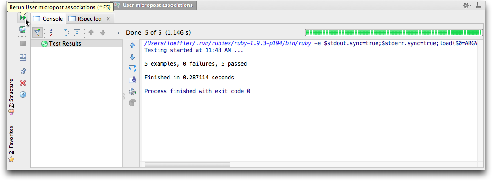

# Running Spork #

The `sample_app` application in [Ruby on Rails Tutorial] recommends running [spork] when doing TTD based on [rspec].  The [RubyMine] IDE comes bundled with a [Spork RDb server] an includes directions for its setup and use. Just be sure to include the proper gems in your `Gemfile`. 

This is the `spec/spec_helper.rb` file. I had some issues when the file was created and had to move code around so check it carefully.  The spork server starts up okay but it really doesn't run well unless this file is correct.

```ruby
require 'rubygems'
require 'spork'
#uncomment the following line to use spork with the debugger
#require 'spork/ext/ruby-debug'

Spork.prefork do
  # Loading more in this block will cause your tests to run faster. However,
  # if you change any configuration or code from libraries loaded here, you'll
  # need to restart spork for it take effect.
  ENV["RAILS_ENV"] ||= 'test'
  require File.expand_path("../../config/environment", __FILE__)
  require 'rspec/rails'
  require 'rspec/autorun'

  # Requires supporting ruby files with custom matchers and macros, etc,
  # in spec/support/ and its subdirectories.
  Dir[Rails.root.join("spec/support/**/*.rb")].each {|f| require f}

  RSpec.configure do |config|
    # ## Mock Framework
    #
    # If you prefer to use mocha, flexmock or RR, uncomment the appropriate line:
    #
    # config.mock_with :mocha
    # config.mock_with :flexmock
    # config.mock_with :rr

    # Remove this line if you're not using ActiveRecord or ActiveRecord fixtures
    config.fixture_path = "#{::Rails.root}/spec/fixtures"

    # If you're not using ActiveRecord, or you'd prefer not to run each of your
    # examples within a transaction, remove the following line or assign false
    # instead of true.
    config.use_transactional_fixtures = true

    # If true, the base class of anonymous controllers will be inferred
    # automatically. This will be the default behavior in future versions of
    # rspec-rails.
    config.infer_base_class_for_anonymous_controllers = false
  end
end

Spork.each_run do
  # This code will be run each time you run your specs.

end
```

I am not sure but I think you don't need to use [spork and guard] together if you have the IDE running the Spork RDb server since guard is a command line tool for controlling spork.

To start the Spork Server just select **Run Spork DRb Server…** under the **Tools** menubar item. Then pick the **RSpec** option.

![Spork Server]


![Spork Server Options]

The log file display will show it is running.
![Spork Server Log]

You can run RSpec on all your tests or you can run it on just a one group or a single test.  You can setup guard to run in the background and use growl to get notifications.  While developing I like running just a group or single test at a time.  One nice keyboard shortcut is to position the cursor in the test(s) you want to run and press ⇧⌃**F10**. The window below shows a run from Chapter 10 of [Ruby on Rails Tutorial] in `user_spec.rb` where cursor is placed just inside the scope of `describe "micropost associations" do` group of 5 tests. When the tests don't pass you can click the top lefthand corner to rerun the tests after making corrections to the code.



Also, you are not limited to just running the tests inside of the [RubyMine] IDE.  You can also open a Terminal or [iTerm 2](http://www.iterm2.com/#/section/home) window and type type in a command like:

    $ bundle exec rspec spec/models/micropost_spec.rb

or 

    $ bundle exec rspec spec/

to run the tests in the `micropost_spec.rb` file or all the tests. 

**NOTE:** Tests run in about the same amount of time whether you use Spork or not.  It is the setup time you save so when you want to time how long it takes try using `time`.  That is, run
     
    $ time bundle exec spec spec/

when the Spork server is off and when it is on.  I found about 25% savings for a single run.  But if I save setup every time so the savings compound.

When I get time I will look into using `guard` as well.


[Spork Server]: images/RunSporkDRbServer.png

[Spork Server Options]: images/RunSporkDRbServerOptions.png

[Spork Server Log]: images/RunSporkDRbServerLog.png


[Ruby on Rails Tutorial]: http://ruby.railstutorial.org/ruby-on-rails-tutorial-book?version=3.2 "Second Edition"
[spork]:http://rubygems.org/gems/spork
[rspec]:http://rspec.info/
[RubyMine]: http://www.jetbrains.com/ruby/
[Spork RDb server]:http://www.jetbrains.com/ruby/webhelp/using-drb-server.html
[Spork and Guard]:http://blog.carbonfive.com/2010/12/10/speedy-test-iterations-for-rails-3-with-spork-and-guard/