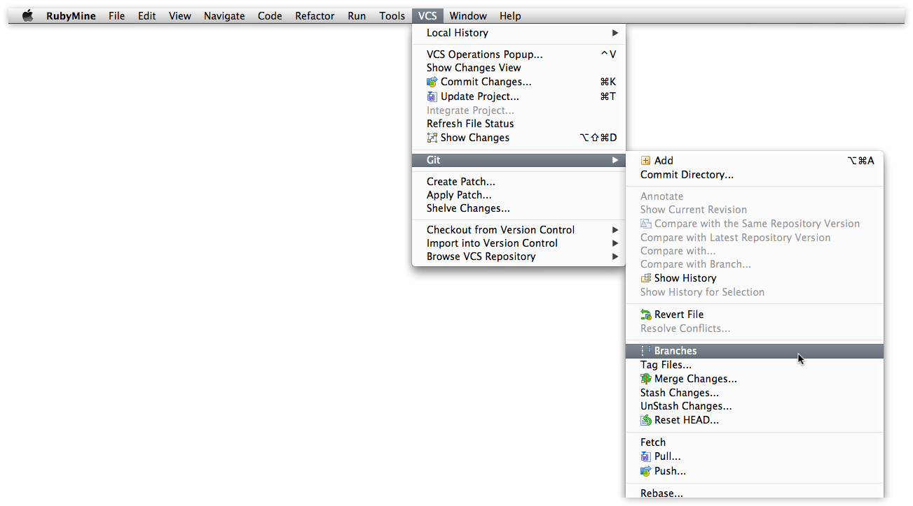
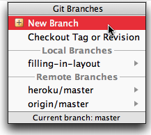
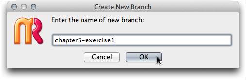
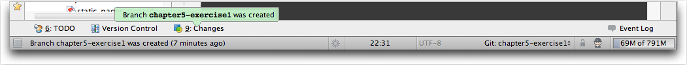
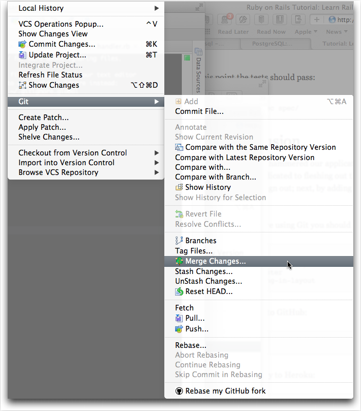
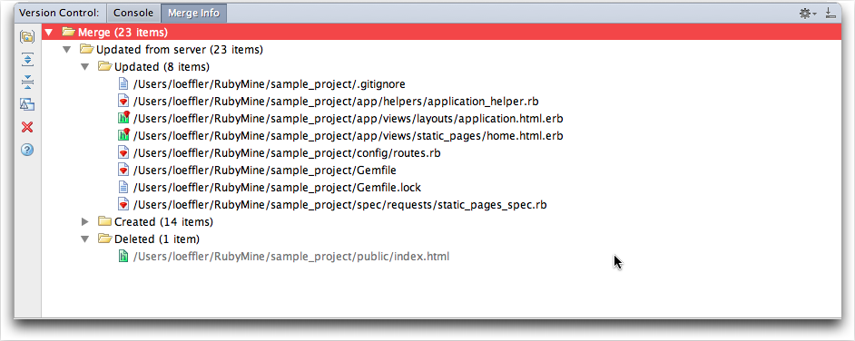
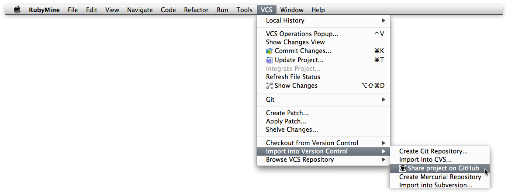

# Using Git In RubyMine #

[RubyMine] handles several different version control system including [CVS], [Mercurial], [Subversion], [Perforce] and [Git].  Help can be found at the [RubyMine git reference].

In the [previous section] we created a [git] repository for the **first_project** and did an initial commit of files.  In this section we'll concentrate on other common [git commands].

1. [Branching](#gitbranch)
2. [Difference](#gitdiff)
3. [Pushing to GitHub](#github)
4. [Pushing to Heroku](#heroku)

### Creating a Branch ###

To create a new branch just click on **VCS** menubar item and select **Branches**

    

Select **New Branch** from the popup window

Fill in the name for the new branch and click **OK**

RubyMine will create the new git branch and check it out.  See bottom of IDE for confirmation.

### Merging Branch in Master ###

In git you should do your work in a branch then switch back to the master branch and merge your changes.  In my opinion this is a good idea even if you are working alone. See [Ruby on Rails Tutorial git Merge notes] and [Pro Git rebase] for more info on `merge` and the alternative `rebase`.  See [RubyMine rebase support] in their online help for 

Then select **master -> origin/master > Checkout** option from **Git Branches** popup menu. This will set you back on the master branch.

Then select the **VCS** menubar item and then the **Git > Merge Changes...** dropdown menu item.

    

This brings up a dialog box showing the current branch and a list of branches to merge.  You can hold cursor over different strategy opptions to get a short description.

After the merge you can see a summary of the merge operation. In this part of the tutorial we deleted the `index.html` file.

### Deleting Branch ###

I find it useful to create a branch, make my changes then merge back into master. Afterward I usually clean up the repository by deleting the branch. See [Ruby on Rails Tutorial git Merge notes].

Deleting a branch is very simple.  Just click on **VCS** menubar item then select **Git > Branches**. 

![Delete git branch] (images/CreateBranch.png)

You will be presented a list of branches.  In this case we want to remove the `static-pages`.

![Delete git branch] (images/DeletingBranchStep2.png)

## GitHub ##

### Initial Setup ###

It is possible to create new repositories on your [GitHub] account. Under the **VCS** menubar item select **Import into Version Control >> Share project on GitHub**

    ![github share]

You will then be prompted for your [GitHub] password.

![github password]

Then enter the name of the new repository and a description.

![github description]

Then you may be prompted for the passphrase for your SSH key. 

![github passphrase]

It will then do the first push of the project up to [GitHub] and the transactions are logged in the Version Control Console.

![Version Control Console][github push log]

### Pushing to GitHub ###
	

## Heroku ##

### Initial Setup ###

### Pushing to Heroku ###

[previous section]:https://github.com/perfectionist/sample_project/wiki/Ruby-Version-Manager-in-Mountain-Lion#wiki-git
[RVM]: http://beginrescueend.com/ "Ruby Version Manager"
[Ruby]: http://www.ruby-lang.org/
[install RVM]: https://rvm.beginrescueend.com/rvm/install/
[RubyGems]: http://rubygems.org/
[Ruby on Rails Tutorial]: http://ruby.railstutorial.org/ruby-on-rails-tutorial-book?version=3.2 "Second Edition"
[RubyMine]: http://www.jetbrains.com/ruby/
[GitHub]:http/github.com
[rubymine git reference]:http://www.jetbrains.com/ruby/webhelp/git-reference.html
[cvs]:http://en.wikipedia.org/wiki/Concurrent_Versions_System
[Mercurial]:http://en.wikipedia.org/wiki/Mercurial
[subversion]:http://en.wikipedia.org/wiki/Subversion
[perforce]:http://en.wikipedia.org/wiki/Perforce
[git]:http://en.wikipedia.org/wiki/Git_(software)
[Ruby on Rails Tutorial git Merge notes]:http://ruby.railstutorial.org/chapters/beginning#sec:git_merge
[Pro Git rebase]:http://progit.org/book/ch3-6.html
[RubyMine rebase support]:http://www.jetbrains.com/ruby/webhelp/rebasing-branches.html
[git commands]:http://git-scm.com/docs

[git init]:images/first_project_git_init.png
[git init select directory]:images/first_project_git_init_select.png
[git init log]:images/first_project_git_log.png
[git add]:images/first_project_git_add.png
[git add all]:images/first_project_git_add_all.png
[git commit]:images/first_project_git_commit.png
[git commit message]:images/first_project_git_commit_message.png
[git commit log]:images/first_project_git_commit_log.png
[github password]:images/first_project_github_password.png
[github description]:images/first_project_github_description.png
[github passphrase]:images/first_project_github_passphrase.png
[github share]:images/first_project_git_push.png
[github push log]:images/first_project_push_log.png

