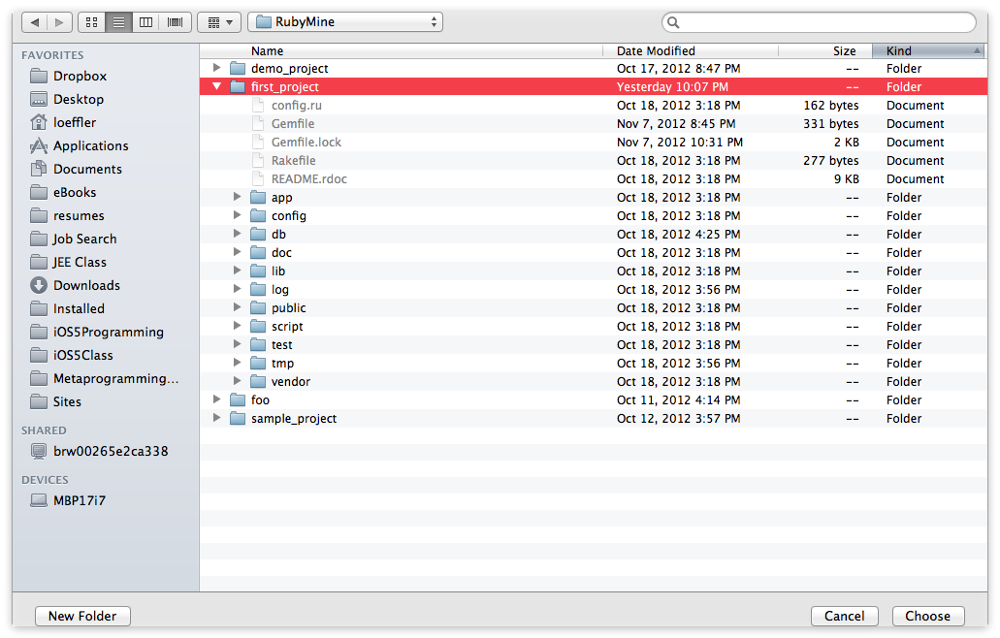
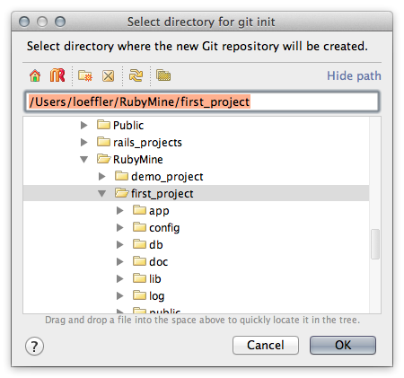
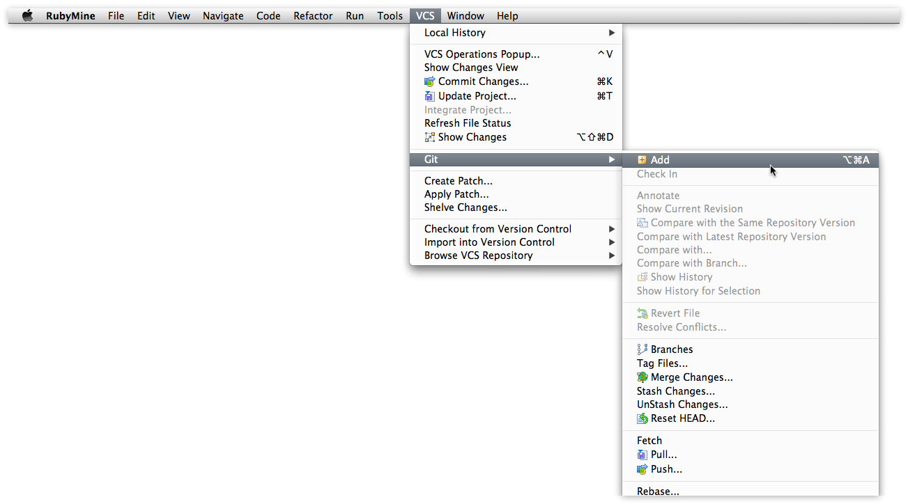
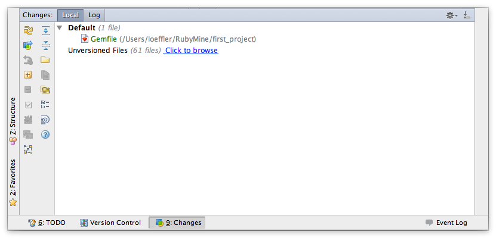
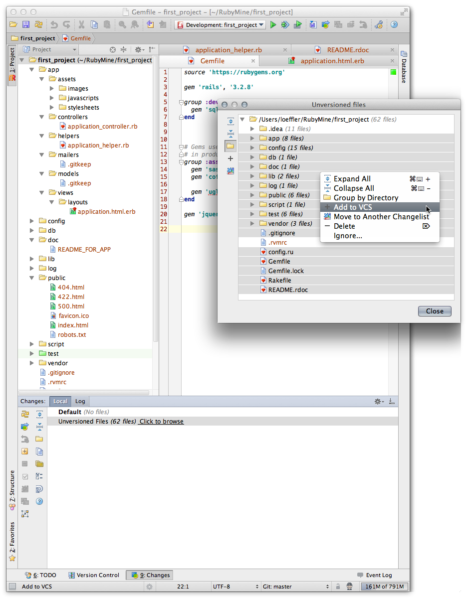
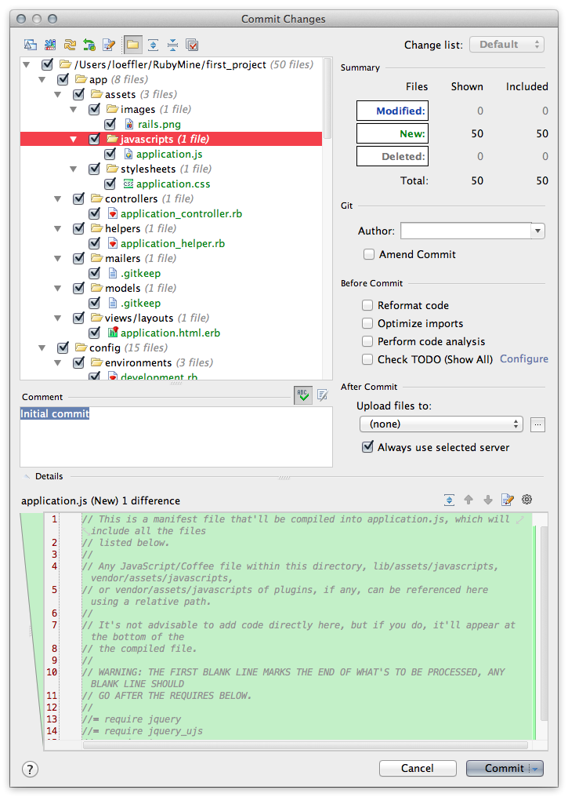
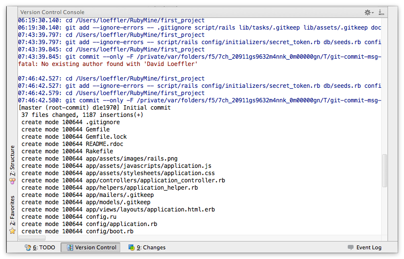

# Using RubyMine IDE for Ruby on Rails Tutorial #

[rewrite]: images/rewrite.png

The instructions here are for the **first_project** but apply for the **demo_project** and **sample_project** as well. Just be sure to follow [Ruby on Rails Tutorial] instructions for **Gemfile**

These are notes about using RubyMIne to setup the **first_app** of Michael Hartl's [Ruby on Rails Tutorial] 2nd edition.  The intent is to show how to use [RubyMine] version 4 as the editor  for the tutorial and more. 

It is possible to initiate a new project from inside [RubyMine] but I advocate a different approach for the first project (I rename **app** to **project**).  These are the steps:

1. [Define a new gemset for `first_project`](#newgemset)
2. [Create New Rails Project](#newrailsproject)
3. [Add RVM resource File](#newresourcefile)
4. [Open Project in RubyMine](#openproject)
5. [Setup IDE](#setup)
6. [Modify Gemfile](#gemfile)
7. [Run Bundler](#bundler)
8. [Setup GIT repository](#git)
9. [Start Rails](#startrails)

## Define New Gemset for first_project ##

Defining gemset and loading rails for the **first_project**

	rvm use 1.9.3-p194@first_project --create
	
I create new **gemset** for each of my project whether rails or just plain ruby.  This gives me flexibility to make changes for a single project without impacting the others. 

## Create New Rails Project ##

	rails new first_project

I create most rails projects from the command line.  I do this because I still like using the command line from time to time and if I do this step and the next I am sure of having the correct environment when I step into the project directory from the command line.

## Add New RVM Resouce File ##

Be sure you are in the projects directory when creating the `.rvmrc` file. This file sets your rvm gemset when you `cd` into the project directory.

	cd first_project
	rvm --rvmrc ruby-1.9.3-p194@first_project

## Open Project in RubyMine ##

After starting [RubyMine] you can make the **first_project** a RubyMine project by selecting **Open Directory…** and navigating to the **first_project** directory and tapping the **Choose** button.

## Setup IDE ##

The first step is to setup the [RubyMine] IDE to use the [RVM] defined [ruby and gemset](rvm). Open the **Preferences** under the **RubyMine** in the menubar. The **Ruby Interpreter** has a drop down menu with RVM gemsets defined on your system.  Pick the that was defined for the tutorial.  

![Setting Ruby version and Gemset in Preferences][Setting Ruby and Gems]

## Modify Gemfile ##

This is the default `Gemfile` created by `rails`.  This is not quite what we want so we'll modify it.

	source 'https://rubygems.org'
	
	gem 'rails', '3.2.8'
	
	# Bundle edge Rails instead:
	# gem 'rails', :git => 'git://github.com/rails/rails.git'
	
	gem 'sqlite3'
	
	
	# Gems used only for assets and not required
	# in production environments by default.
	group :assets do
	  gem 'sass-rails',   '~> 3.2.3'
	  gem 'coffee-rails', '~> 3.2.1'
	
	  # See https://github.com/sstephenson/execjs#readme for more supported runtimes
	  # gem 'therubyracer', :platforms => :ruby
	
	  gem 'uglifier', '>= 1.0.3'
	end
	
	gem 'jquery-rails'
	
	# To use ActiveModel has_secure_password
	# gem 'bcrypt-ruby', '~> 3.0.0'
	
	# To use Jbuilder templates for JSON
	# gem 'jbuilder'
	
	# Use unicorn as the app server
	# gem 'unicorn'
	
	# Deploy with Capistrano
	# gem 'capistrano'
	
	# To use debugger
	# gem 'debugger'
	

The  edited `Gemfile` should look like this:

	source 'https://rubygems.org'
	
	gem 'rails', '3.2.8'
	
	group :development do
	  gem 'sqlite3', '1.3.5'
	end
	
	
	
	# Gems used only for assets and not required
	# in production environments by default.
	group :assets do
	  gem 'sass-rails',   '3.2.5'
	  gem 'coffee-rails', '3.2.2'
	
	  gem 'uglifier', '1.2.3'
	end
	
	gem 'jquery-rails', '2.0.2'
	

## Run Bundler ##

Any time you modify the **Gemfile** you should run **Bundler**. 

![Bundler]

The installer will present another dialog for additional arguments to run with **bundle install**. 

![Bundler install dialog]

In our case there are no additional arguments. *Pay attention to other the other apps in the tutorial where there is an argument.* 

## Setup GIT Repository ##

At this point we do not yet have our software under version control.  [RubyMine] has tools for [git], CVS, Mercurial ([hg]), and Subversion ([svn]).  Setting up a git repository is straight forward but there a lot of screens as you can see below.  These screens basically do the following git commands:

    git init
    git add .
    git commit -m "Initial commit"

The difference is you visually see which files you are committing without having to use `git status`.  We want to avoid committing the `.idea` directory and the `.rvmrc` file. (Working alone I would add the `.rvmrc` file to the repository.)

Select **Create Git Repository** to create the initial repository (`git init`).

Then select the **first_project** directory (in the command line you need to be *in* the directory).

Then say **Yes** to confirm you selection.

The **Version Control Console** shows the **git** command ran and the output, just like you would have run `git init` at the command line.

Now to execute the `git add .` command but we'll define the files to add instead of depending on the “.” . Later we might add the `.idea` directory to the `.gitignore ` file to make life easier when using the command line.

From the **VCS** menu bar item, select **Git > Add**

Click on the **Click to browse** link to see all the files that can be added to the repository.

Select the files and directories to add

Now we doing the **commit** ( `git commit -m "Initial commit"` ) of the added files to the repository.

First right click in **Changes** pane.

Then make sure of the files you want to commit, add the _Initial commit_ comment and you can even review differences between the file you are committing and the version in the repository (in this case we don't have any previously committed files).

In the **Version Control Console** you can view the results of running the git commit command (this is the same as if you ran it from the command line).

## Start Rails ##

The rails server can be started from inside [RubyMine]. Just select **Run** from menubar and then either select **Run 'Development: first_project'** or **Run…**.  (Remember I named my app `first_project` not `first_app`.)  Here I chose the later.

![Rails Server]

This brings up a selection where you can create custom run configurations or pick one already defined. I chose a predefined one for development.

![Rails Server Dialog]

The web site for [`127.0.0.1:3000`](http://127.0.0.1:3000/) shows the **Welcome aboard** page indicating success.

![first project web site]

The bottom section of the [RubyMine] IDE displays the server log file.  The left side panel has some contral actions. The key one for me is the **red square** which stops the server.

![Rails Server Log]

* * * 

Last modified: December 2, 2012 11:05 AM 

[RubyMine Menubar]:images/rubymine_menubar.png "Menubar"
[Setting Ruby and Gems]:images/first_project_settings.png
[New Project Dialog]:images/first_project.png
[First Project]:images/first_project_create_log.png
[Bundler]:images/first_project_bundler.png
[Bundler install dialog]:images/first_project_bundler_args.png
[Rails Server]:images/first_project_server_run.png
[Rails Server log]:images/first_project_server_run_log.png
[Rails Server Dialog]:images/first_project_server_run_selection.png
[first project web site]:images/first_project_web_site.png

[RVM]: http://beginrescueend.com/ "Ruby Version Manager"
[Ruby]: http://www.ruby-lang.org/
[install RVM]: https://rvm.beginrescueend.com/rvm/install/
[RubyGems]: http://rubygems.org/
[Ruby on Rails Tutorial]: http://ruby.railstutorial.org/ruby-on-rails-tutorial-book?version=3.2 "Second Edition"
[Sublime]: http://www.sublimetext.com/2 "Sublime Text 2"
[Rails 3.2.3]: http://weblog.rubyonrails.org/2012/3/30/ann-rails-3-2-3-has-been-released/
[rvm delete]: http://beginrescueend.com/gemsets/deleting/
[rvm empty]: http://beginrescueend.com/gemsets/emptying/
[RubyMine]: http://www.jetbrains.com/ruby/
[GitHub]: http://github.com "GitHub"
[RVM]: http://beginrescueend.com/
[git]:http://git-scm.com
[svn]:http://subversion.apache.org
[hg]:http://mercurial.selenic.com