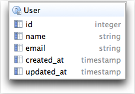
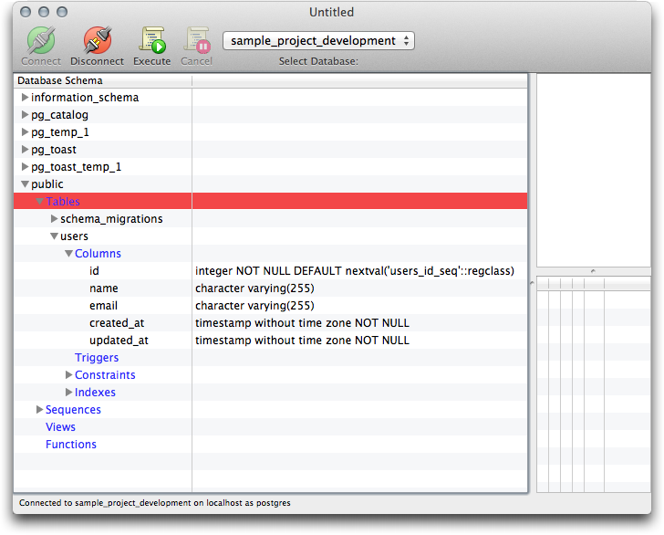
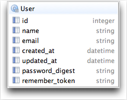

# Data Model From Chapter 6 #

I will be posting a parallel version of the data model using PostgreSQL from chapter 6 onward.

This is the `User` data model show in figure 6.2 in tutorial.

Structure of the Postgres table `users` you can compare with figure 6.3 for sqlite3.

Data Model after adding password including `timestamp` columns.

