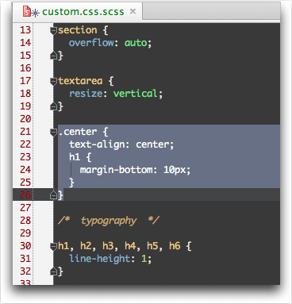

# Extras #

## Useful Prefences ##

Setting **EOL** (TODO)

Tabs as Spaces (TODO)

## Keyboard Mappings ##

Keymap for Mac, to be nice, is *odd*, for example:

* **&#8984; P** is Parameter info (within method call arguments) not Print
* **&#8984; N** is Go to Class not New File 
* **^N** is New File not Next Line

To name just a few.  

Mac Keymap ([PDF](http://www.jetbrains.com/ruby/docs/RubyMine_ReferenceCard_Mac.pdf))

Windows Keymap ([PDF](http://www.jetbrains.com/ruby/docs/RubyMine_ReferenceCard.pdf))

## Online Help ##

http://www.jetbrains.com/ruby/webhelp/getting-help.html

## Reformat Code ##

[RubyMine]: http://www.jetbrains.com/ruby/ "Ruby on Rails IDE"
[Ruby on Rails Tutorial]: http://ruby.railstutorial.org/ "Rails Tutorial"
[chapter 2]: http://ruby.railstutorial.org/chapters/a-demo-app?version=3.2#top
[Model Dependency Diagram video]: http://www.jetbrains.com/ruby/demos/rubymine_model_diagram.html
[GitHub]: http://www.github.com/ "GitHub"
[inkscape]:http://inkscape.org/
