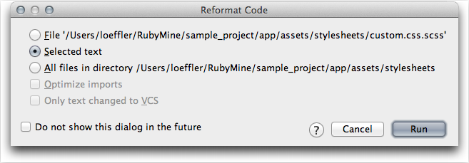

# Extras #

## Model Diagrams ##

It is easy to create a data model diagram with [RubyMine].  Here I'll do the model for the **demo_app** in the [Ruby on Rails Tutorial] in [chapter 2].  This app has just 2 models: `user` and `micropost`.  Just pick the **View** item in the RubyMine menu bar (shown below).

Then select **Show Model Dependency Diagram** from the drop down menu.

The diagram is displayed in its own sub window.  There are a number of display options that let you see more or less information and on applications with more models there are various layout options. See the [Model Dependency Diagram video].

The diagram can be exported to a number of different formats.  

The PNG format is shown below. **Note:** the **Powered by yFiles** label on the PNG.  This can be removed from the SVG output by using an editor.  But, unfortunately SVG can not be displayed on [GitHub] 

If you export with SVG option you should be able to remove the **Powered by yFile** label.  I removed it using Inkscape.  SVG image may not appear on this wiki.

## Keyboard Mapping ##

Keymap for Mac, to be nice, is *odd*, for example:

* **&#8984; P** is Parameter info (within method call arguments) not Print
* **&#8984; N** is Go to Class not New File 
* **^N** is New File not Next Line

To name just a couple.  

Mac Keymap ([PDF](http://www.jetbrains.com/ruby/docs/RubyMine_ReferenceCard_Mac.pdf))

Windows Keymap ([PDF](http://www.jetbrains.com/ruby/docs/RubyMine_ReferenceCard.pdf))

## Online Help ##

http://www.jetbrains.com/ruby/webhelp/getting-help.html

## Reformat Code ##

[RubyMine]: http://www.jetbrains.com/ruby/ "Ruby on Rails IDE"
[Ruby on Rails Tutorial]: http://ruby.railstutorial.org/ "Rails Tutorial"
[chapter 2]: http://ruby.railstutorial.org/chapters/a-demo-app?version=3.2#top
[Model Dependency Diagram video]: http://www.jetbrains.com/ruby/demos/rubymine_model_diagram.html
[GitHub]: http://www.github.com/ "GitHub"