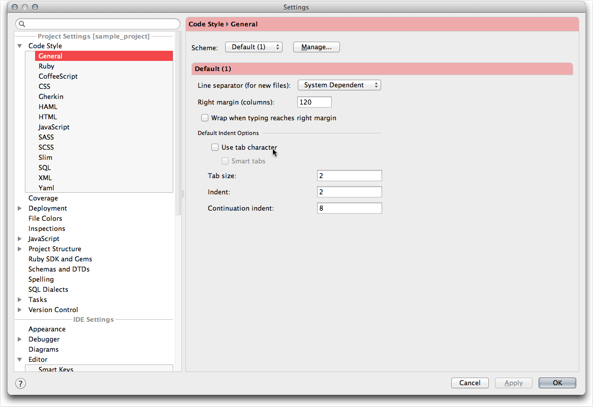
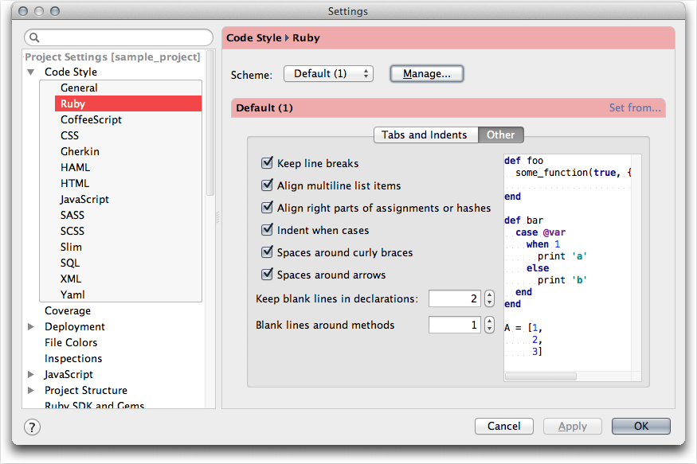
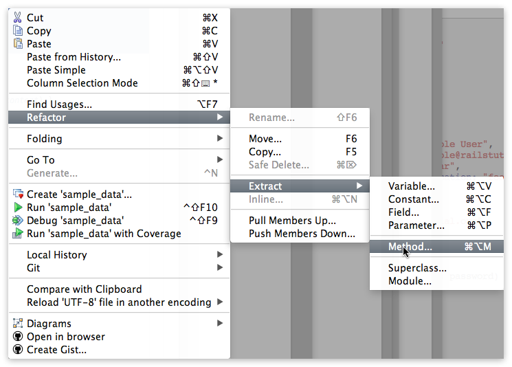
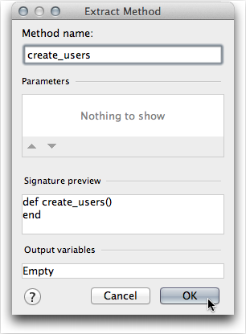
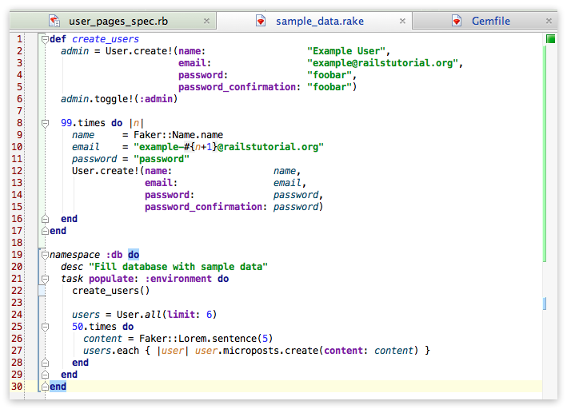

# Extras #

## Useful Prefences ##

### Setting Caret Position to EOL ###

The default setting for caret placement is where you point the mouse pointer.  This is annoying for me since I like the caret to move to the end of the line (EOL).  To get the behavior I wanted I had to go to the **Editor** preference pane and uncheck **Allow Placement of caret after end of line**.

## Tabs as Spaces ##

I gave up using tab character after having to write and debug Make files over 20 years ago.  To not use them in [RubyMine] go to the **Code Style** preference pane.  Each situation listed under it is where you can elect to use or not use tab character. 

## Keyboard Mappings ##

Keymap for Mac, to be nice, is *odd*, for example:

* **&#8984;P** is Parameter info (within method call arguments) not Print
* **&#8984;N** is Go to Class not New File 
* **^N** is New File not Next Line

To name just a few.  

Mac Keymap ([PDF](http://www.jetbrains.com/ruby/docs/RubyMine_ReferenceCard_Mac.pdf))

Windows Keymap ([PDF](http://www.jetbrains.com/ruby/docs/RubyMine_ReferenceCard.pdf))

## Online Help ##

http://www.jetbrains.com/ruby/webhelp/getting-help.html

## Reformat Code ##

Reformatting code is easy with [RubyMine].  Under the **View** menubar the drop down menu has **Reformat Code…**. I prefer to use the **&#8997;&#8984;L** (for Mac). This works for Ruby, CSS, and other code.

The **Reformat Code** dialog box pops up and lets you change the default option.  I keep this popping up since the keyboard short cut is the same as **Apply Rules** in Mail app and I hate is when I blindly use the keyboard short cuts without looking at exactly which app I am in. 

The example here is a `scss` file that has been reformatted. 

There is a preference panel for coding styles.  Shown below is the one for Ruby. 

## Refactoring ##

In Chapter 11, [Figure 11.17](http://ruby.railstutorial.org/chapters/following-users#code:sample_relationships) we have our first opportunity to use refactoring on the `sample_data.rake` file.  We had defined a block to create users and then add 50 micro posts to the first 6 users in the database. Now we want to add follower/followed relationships between the users.  It just *feels* like the right time to tease apart the block a little.

The first step is to highlight the code that will be extracted into a method.  Below is the code that will become the `create_user` method.

You can either right click and select **Refactor > Extract > Method** or use the keyboard shortcut, 
**&#8984;&#8997;M**. If there is an error, the message sometimes does not show up with the right click method.  But it worked when I used **&#8984;&#8997;M**.  Try for yourself by highlighting the one extra line above the code shown above. 

The next step is setting the new method's name, in this case it is `create_users`. In this case there are no parameters or output variables. 

The extracted method is put at the beginning of the file. Personally, I prefer after the block or at the end of the file.  But moving after the refactoring is not too hard.

To move the `create_users` method to the end of the file is pretty easy using a *trick*.  The trick is using (on Mac) **&#8984;W**.  First position the cursor inside the method then successively press **&#8984;W**.  Each time it will select more more level of code, eventually it will select the entire method.  If you go too far then use **&#8984;&#8679;W** to back down a level. Then cut the method, move to the bottom of the file and paste.  

[RubyMine]: http://www.jetbrains.com/ruby/ "Ruby on Rails IDE"
[Ruby on Rails Tutorial]: http://ruby.railstutorial.org/ "Rails Tutorial"
[chapter 2]: http://ruby.railstutorial.org/chapters/a-demo-app?version=3.2#top
[Model Dependency Diagram video]: http://www.jetbrains.com/ruby/demos/rubymine_model_diagram.html
[GitHub]: http://www.github.com/ "GitHub"
[inkscape]:http://inkscape.org/
