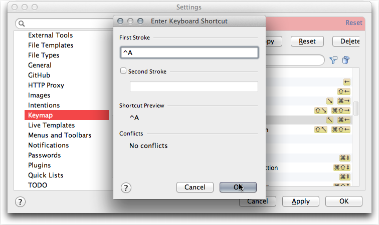

css:   https://dl.dropbox.com/u/12643381/styles/github5.css

# Add Keybindings #

VIM Plugin http://plugins.intellij.net/plugin/?ruby&id=164

I am using MacBook Pro keyboard so some keys are not available like PageDown, PageUp, etc.   My Bluetooth keyboard matches the laptop keyboard.

with the mac is a little confusing since documentation equates
command with control key. 

Adding new keybinding is pretty simple and you can even have multiple keys bound to the same command.
My favorite 

`^A`

Steps to add `^A` 

`^K`

| Key 	| Cocoa / Emacs action 	| Editor Action	| Existing Key 	|
| :----:	| ----------------------	| ----------------	| :----: 	|
| &#8963;A	| move to beginning of line	| Move Caret to Line Start	| ??	|
| &#94;B	| move left one character 	| Left 	| &larr;	|
| &#94;F 	| move right one character 	| Right	| &rarr;	|
| &#94;N 	| move down one line	| Down	| &darr;	|
| &#94;P 	| move up one line 	| Up	| &uarr;	|
| &#8997;F	| move right one word	| Move Caret to Next Word	| &#8997;&rarr;	|
| 	| move left one word 	| Move Caret to Previous Word 	| &#8997;&larr;	|
| &#94;K	| delete to end of line	| Cut up to Line End	| 	|
| &#8963;D	| forward delete 	| 	| 	|
| &#8963;V	| scroll one page	| Page Down	| PageDown	|
| 	| scroll up one page	| Page Up	| PageUp	|
| &#94;E 	| move to end of line	| Caret to Line End 	| &#8987;&rarr; 	|
| &#8963;Y 	| paste text previously yanked with &#8963;K	| Paste Simple	| &#8984;&#8997;&#8679;V	|
	

 
 
&#8984; Command

&#8997; Option

&#8997; B can not be assigned.
&#8997; V can not be assigned

&#x23CE; Return Key

&#8963; Control

&#8677; Tab

 U+21E4 Tab back?

&#9099; escape

&#8679;  Shift

&icirc;

&larr; 

&rarr;

&darr; &uarr;

Conflicts!

^N 

.round {
  -moz-border-radius:    5em;
  -webkit-border-radius: 5em;
  border-radius:               5em;
} 

	option-delete	back delete one word
	shift-option-delete	foward delete one word (equivalent to option-del)
	option-up arrow	move up one paragraph
	option-down arrow	move down one paragraph
	command-up arrow	move to beginning of all text
	command-down arrow	move to end of all text
	control-left arrow	move to start of current line
	command-left arrow
	control-right arrow	move to end of current line
	command-right arrow
	shift + any of the above	extend selection by appropriate amount
	click then drag	select text
	double-click then drag	select text, wrapping to word ends
	triple-click then drag	select text, wrapping to paragraph ends
	shift-select text with mouse	add to selection (contiguous)
	command-select text with mouse	add to selection (non-contiguous)
	option-drag	select rectangular area (non-contiguous)
	command-option-drag	add rectangular area to selection
	drag selection	move text
	option-drag selection	copy text
	command-control-D	use the dictionary to look up the word under the mouse pointer
	escape	show auto-complete list for word (equivalent to F5 or option-escape)
	control-H	delete
	
	control-O	insert new line after cursor

## Favorites ##

&#8963;&#8679;F10 inside spec file.

## Favorite Abbrevs ##

`des` for describe

* * * 

**Simple Table**

| Item 	| Description 	| Unit Price 	| Quantity 	|   Total 	|  
| :----- 	| :---------------------- 	| -------------: 	| :------: 	| ------: 	|  
| Widget 	| The latest widget model 	|          $3.01 	|    100 	| $301.00 	|  
[Simple Table with break in header][simpletable]

**Spanning a Column**

| Item 	| Description 	| Unit Price 	| Quantity 	|   Total 	|  
| :----- 	| :---------------------- 	| -------------: 	| :------: 	| ------: 	|  
| Widget 	| The latest widget model 	|          $3.01 	|    100 	| $301.00 	|  
| Gizmo 	| The fastest gizmo 	|         $30.00 	|      1 	|  $30.00 	|
| **Total** 	|||| **$331.00**	|
[Table with spanning in last row]

| 	|          Grouping 	||
|     First Header 	| Second Header 	| Third Header 	|
|      ------------ 	| :-----------: 	| -----------: 	|
|   Content 	| *Long Cell* 	||
|   Content 	| **Cell** 	|  Cell 	|
|   New section 	| More 	| Data 	|
|   And more 	|  And More 	||
[Table with multiple headers and spanning]
