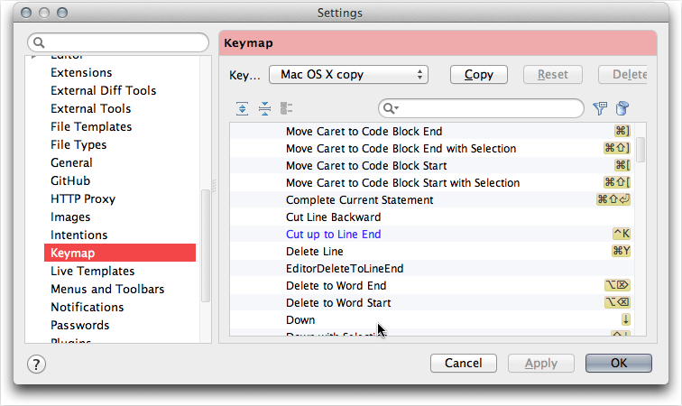

# Add Keybindings #

with the mac is a little confusing since documentation equates
command with control key. 

Adding new keybinding is pretty simple and you can even have multiple keys bound to the same command.
My favorite 

`^A`

Steps to add `^A` 

`^K`

| Key 	| Cocoa / Emacs action 	| RubyMine Keymap	|
|:----:	|----------------------	|----------------	|
| ^B	| move left one character 	| Left 	|
| ^F 	| move right one character 	| Right	|

`^F`  - Right

`^N` move down one line - Down

`^P` move up one line - Up

option-left arrow	move left one word
option-right arrow	move right one word
control-delete	delete accent to left
option-delete	back delete one word
shift-option-delete	foward delete one word (equivalent to option-del)
option-up arrow	move up one paragraph
option-down arrow	move down one paragraph
command-up arrow	move to beginning of all text
command-down arrow	move to end of all text
control-left arrow	move to start of current line
command-left arrow
control-right arrow	move to end of current line
command-right arrow
shift + any of the above	extend selection by appropriate amount
click then drag	select text
double-click then drag	select text, wrapping to word ends
triple-click then drag	select text, wrapping to paragraph ends
shift-select text with mouse	add to selection (contiguous)
command-select text with mouse	add to selection (non-contiguous)
option-drag	select rectangular area (non-contiguous)
command-option-drag	add rectangular area to selection
drag selection	move text
option-drag selection	copy text
command-control-D	use the dictionary to look up the word under the mouse pointer
escape	show auto-complete list for word (equivalent to F5 or option-escape)
control-A	move to start of current paragraph
control-B	move left one character
control-D	forwards delete
control-E	move to end of current paragraph
control-F	move right one character
control-H	delete
control-K	delete remainder of current paragraph
control-N	move down one line
control-O	insert new line after cursor
control-P	move up one line
control-T	transpose (swap) two surrounding character
control-V	move to end, then left one character
control-Y	paste text previously deleted with control-K

