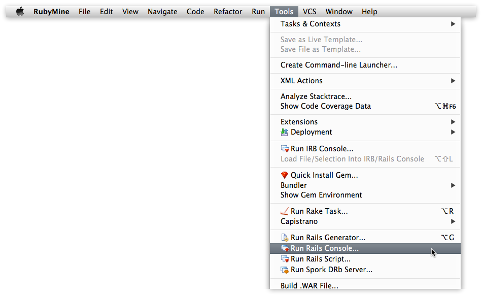
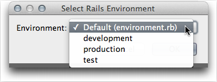
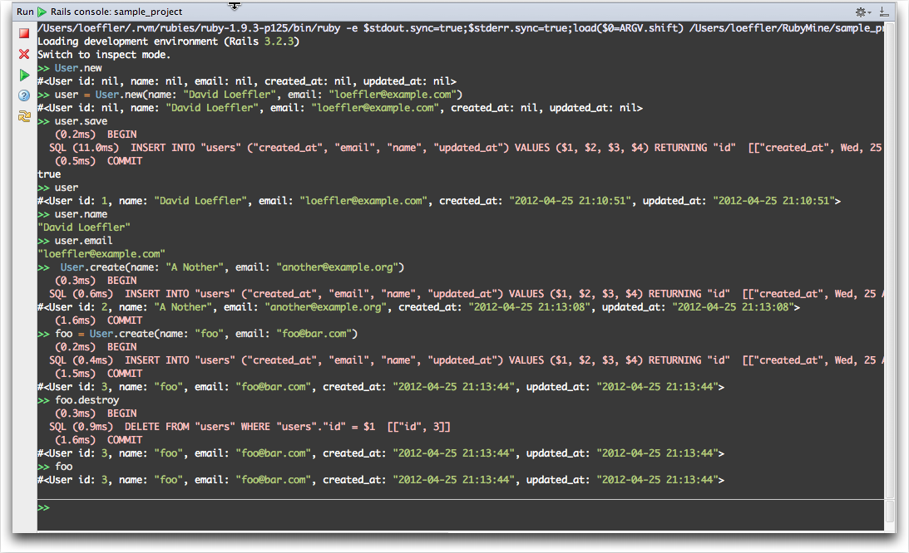

# Rails Console #

The **Rails Console** can be accessed from the [RubyMine] menubar **Tools**

Just select **Run Rails Console…**

Then select the environment.  There is no option for adding `--sandbox` option, sigh. I took **default** which is seems to be the same as **development**.

The next two panels show the results of running the examples in [section 6.1.3]

[RubyMIne]:http://www.jetbrains.com/ruby/
[section 6.1.3]:http://ruby.railstutorial.org/chapters/modeling-users#sec:creating_user_objects